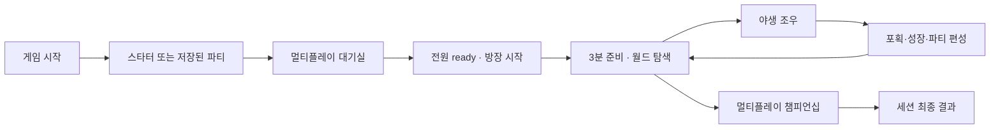
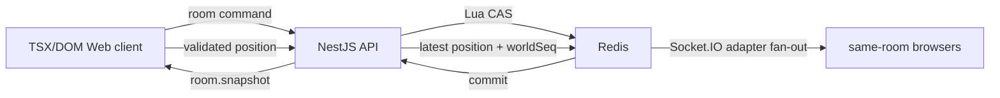

# Poke Lounge Game Concept

확인 기준일: 2026-08-31
구현 기준: `main`

이 문서는 Poke Lounge의 제품 의도와 현재 구현 경계를 설명한다. 게임 진행 순서와 고정 수치는
[게임 규칙 인덱스](./poke-lounge-rules/index.md), 테스트 절차는
[플레이어 E2E 테스트 시나리오](./poke-lounge-multiplayer-test-scenarios.md)를 기준으로 한다.

Poke Lounge는 비공식 Pokémon 팬 게임이다. 기술 구현이나 배포 성공은 관련 명칭·표장·데이터·
에셋의 공개 사용 권리를 의미하지 않는다. 공개 출시 권리 상태는
[Poke Lounge Release Gate](./poke-lounge-release-gate.md) 기준 `UNRESOLVED`다.

## 한 문장 컨셉

친구와 같은 월드에서 각자의 포켓몬을 탐색·포획·육성하고, 짧은 챔피언십으로 우승을 겨루는
브라우저형 팬 게임이다.

## 제품 정체성

Poke Lounge는 장편 RPG나 MMO보다 짧은 세션의 탐색·육성·대전 루프에 집중한다. 설치 없이
데스크톱 키보드와 모바일 터치로 시작하며, 멀티플레이 접속 절차보다 실제 플레이를 앞세운다.

| 설계 축          | 의도                                                        |
| ---------------- | ----------------------------------------------------------- |
| 브라우저 접근성  | 별도 설치 없이 데스크톱과 모바일 브라우저에서 시작한다.     |
| 함께하는 월드    | 같은 세션 참가자의 닉네임과 움직임을 실시간으로 공유한다.   |
| 개인 진행        | 포획·파티·재화와 솔로 전투는 각 사용자의 진행으로 유지한다. |
| 익숙한 전투 감각 | Gen 4풍 턴제 전투, 포획과 성장 경험을 제공한다.             |
| 서버 권위 경쟁   | 대진, 전투 상태와 결과를 서버가 확정한다.                   |

## 플레이 경험



첫 참가자는 대기실의 방장이 된다. 최대 8명의 현재 파티가 동기화되고 모든 사람 참가자가
ready를 선택하면 방장이 1라운드를 시작한다. 시작 시 사람과 수동 AI가 1~~3명이면 4명까지,
4~~7명이면 8명까지 AI를 자동 추가한다. AI는 시작 snapshot부터 참가자로 존재하며 같은 3분
준비 동안 사냥·포획하고 이후 토너먼트에도 참가한다. 시작 뒤 신규 참가자는 받지 않는다.
정상적으로 1·2라운드를 완료하면 다음 준비는 자동 시작한다.

입장, 인원, 동일 사용자와 재접속 판정은 [멀티플레이 규칙](./poke-lounge-rules/multiplayer-rules.md),
탐색·성장·경제·조작은 [플레이와 성장 규칙](./poke-lounge-rules/play-and-growth.md), 전투 동작은
[전투 규칙](./poke-lounge-rules/battle-rules.md), 챔피언십 진행과 점수는
[3라운드 챔피언십 규칙](./poke-lounge-rules/three-round-championship.md)을 따른다.

## 기술 구조

```text
apps/web
  Next.js route와 React shell
  TSX/DOM WorldScreen / BattleScreen
  local save, room adapter, UI와 입력

apps/api
  transient Poke Lounge room과 live position gateway
  공개 session action과 서버 권위 competitive match

packages/poke-lounge-battle
  솔로·경쟁 전투 규칙
  canonical state, PRNG와 bracket

Redis
  room aggregate, participant와 command receipt
  competitive match/action, account save와 live position
```

Web과 API는 `@poke-lounge/battle`의 결정론적 규칙을 공유한다. API DTO에서 생성한 로컬
OpenAPI JSON과 Web generated type이 두 앱 사이의 계약 기준이다.

공개 멀티플레이의 접속 상태는 Redis가 TTL 동안 보관하고, REST는 생성·참가와 장애 복구를,
Socket.IO는 승인된 참가자의 실시간 위치와 committed snapshot 전파를 담당한다.



일반 room mutation은 idempotency key와 마지막 committed revision을 사용한다. 서버는 상태와
명령 receipt를 같은 Lua CAS에서 저장한 뒤 snapshot을 발행한다. Web은 Socket 연결 장애나
revision conflict에서 REST snapshot으로 복구하며 상시 polling이나 API 메모리 상태에 의존하지
않는다.

완료된 이전 match의 terminal transition과 현재 assignment는 snapshot에서 분리한다. Web은
terminal event와 match를 중복 제거한 뒤 결과를 먼저 적용하고, 현재 assignment가 있는 참가자만
다음 전투를 시작한다.

플레이어 위치는 Redis Hash의 최신 snapshot과 `worldSeq`로 복구한다. Socket.IO Redis Adapter가
여러 API 인스턴스 사이의 방 이벤트를 fan-out한다. Redis room revision과 `worldSeq`는 같은
저장소를 사용하지만 서로 독립된 cursor다.

## 저장과 복구

| 상태             | 저장 위치                | 범위                                                       |
| ---------------- | ------------------------ | ---------------------------------------------------------- |
| 익명 플레이어    | versioned `localStorage` | 같은 브라우저 프로필의 파티·박스·재화·위치와 UI 상태       |
| 방 재개 identity | `localStorage`           | 계정별 playerId·sessionId, 현재 방과 서버 만료 시각        |
| 서버 방          | Redis TTL                | room aggregate, revision, TTL과 command receipt            |
| 경쟁 매치        | Redis TTL                | canonical battle state, action receipt와 terminal metadata |
| 실시간 위치      | Redis                    | 방 수명 동안 map, 좌표, 방향과 worldSeq                    |

로그인 없는 플레이 진행과 방 재개 identity는 같은 브라우저 프로필에 저장한다. 임시 비밀번호 원문과
ID token은 저장하지 않으며, 멀티플레이의 최종 상태는 서버 snapshot을 기준으로 복구한다.

## 화면과 오디오

월드와 전투는 TSX/DOM pixel-art 화면으로 렌더링한다. 화면 경계는
[Poke Lounge 화면 경계 정책](./poke-lounge-viewport-layout.md), 키보드·모바일 입력은
[플레이와 성장 규칙](./poke-lounge-rules/play-and-growth.md)을 따른다.

필드와 전투 오디오는 첫 사용자 입력 뒤 활성화한다. 현재 런타임 오디오의 기술적 추출 경로는
[Poke Lounge Audio Sources](./poke-lounge-audio-sources.md)에서 관리한다.

## 검증과 현재 범위

검증은 공통 엔진 unit, Web unit, API unit·Redis integration, HTTP/Socket E2E와 Playwright
브라우저 시나리오로 나눈다. 현재 자동화 범위와 남은 수동 검증은
[플레이어 E2E 테스트 시나리오](./poke-lounge-multiplayer-test-scenarios.md)를 따른다.

현재 구현 범위:

- 솔로 월드 탐색, 야생전, 포획, 성장, 상점, 인벤토리와 PC 박스
- 데스크톱 키보드와 모바일 터치 입력
- shared world 참가와 닉네임·위치 실시간 중계
- 서버 권위 대진·전투·결과와 Redis TTL room 복구
- 브라우저 프로필의 versioned `localStorage` 기반 익명 진행·방 재개 저장
- 방장·수동 ready·수동 시작 기반 멀티플레이 대기실과 시작 후 참가 잠금
- 방 시작 시 4인 또는 8인까지 AI 자동 충원과 준비·토너먼트 자동 행동
- Redis snapshot·worldSeq 기반 위치 누락 복구와 API 인스턴스 간 Socket fan-out

현재 제약:

- 월드는 단일 마을이며 장거리 탐험, 퀘스트와 스토리 캠페인은 없다.
- 파티·재화 진행은 사용자마다 독립적이다.
- 수동 WebRTC는 개발·실험 경로이며 운영 멀티플레이가 아니다.
- UI와 인게임 용어·상태 문구는 URL 로케일에 따라 한국어·영어·일본어로 표시된다.
- 물리 모바일 기기와 실제 네트워크 품질의 장시간 game-feel 검증은 별도다.

## 후속 출시 작업

에셋 출처·권리 검증 자동화는 현재 개발 범위에서 제거했다. 공개 출시를 준비할 때 별도 작업으로 다시 검토한다.

## Source of truth

| 주제                | 기준 문서·코드                                                              |
| ------------------- | --------------------------------------------------------------------------- |
| 제품 게임 규칙      | [게임 규칙 인덱스](./poke-lounge-rules/index.md)                            |
| 현재 제품·구현 경계 | 이 문서                                                                     |
| 플레이어 E2E 검증   | [플레이어 E2E 테스트 시나리오](./poke-lounge-multiplayer-test-scenarios.md) |
| 점수와 공개 랭킹    | [Game Score Policy](./game-score-policy.md)                                 |
| Web runtime         | `apps/web/src/components/poke-lounge/runtime/game/`                         |
| 서버 room과 경쟁전  | `apps/api/src/poke-lounge/`                                                 |
| 공통 전투·대진 규칙 | `packages/poke-lounge-battle/`                                              |
