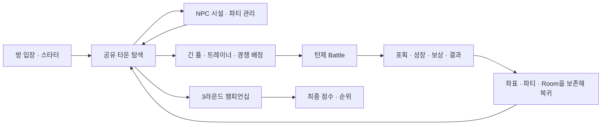

# Poke Lounge 게임성 보존 Phaser → TSX/DOM 이식 기준

- 작성일: 2026-08-30
- 대상 브랜치: `refactor/phaser-to-web`
- 기준 커밋: `bea41a6` (`main`, Phaser 제거 PR revert)
- 상태: P0–P6 구현과 검증 완료, Phaser 없는 TSX/DOM 런타임으로 전환
- 검증 수준: 정적 검사, Web unit 302개, browser E2E 133개, local-test-mode, 실제 5인 통합,
  production build, audio verifier와 수동 브라우저 플레이

## 1. 결정

Poke Lounge의 Phaser 제거는 제품 재설계가 아니라 **렌더링 계층 이식**으로 수행한다.

> 같은 게임, 다른 렌더러.

아래 게임 정체성과 플레이 계약은 바꾸지 않는다.

- 공유 타운을 직접 이동하는 실시간 탑다운 RPG
- NPC 근접 상호작용과 개인 파티·재화 관리
- 긴 풀 타일 이동으로 시작하는 야생 조우
- Gen 4풍 턴제 전투, 포획, 성장, 진화와 기술 학습
- 같은 월드의 원격 플레이어와 실시간 위치 공유
- 서버 권위 경쟁전과 정확히 3라운드인 챔피언십
- 데스크톱 키보드와 모바일 터치에서 동등한 기능

모든 활성 사용자 UI는 TSX 컴포넌트가 소유한다.

- 입장, 스타터, 로딩, 오류, 로비, 월드, 전투, 설정, 결과와 모바일 화면을 모두 포함한다.
- 월드 타일, 로컬·원격 플레이어, NPC, HUD, 시설, 전투 sprite·메뉴·연출도 React 컴포넌트
  트리에서 생성한다.
- Phaser drawing이나 `document.createElement`, `innerHTML`, `replaceChildren`로 production UI를
  만들지 않는다.
- `requestAnimationFrame`이 이미 렌더된 actor·camera 컴포넌트 ref의 CSS transform과 sprite
  frame style을 갱신하는 것은 허용한다.
- 컴포넌트화는 모든 장식용 `<span>`을 별도 파일로 만드는 뜻이 아니다. 독립 화면, 패널,
  다이얼로그, 메뉴, 목록 행, actor, 반복되는 상태 표현을 이름 있는 컴포넌트로 만든다.
- 컴포넌트 하나당 파일 하나를 강제하지 않으며, 작은 하위 컴포넌트는 해당 feature에 함께 둔다.

컴포넌트화는 이식 후 선택적으로 하는 정리 작업이 아니라 Phaser 제거 전 완료 조건이다.

자유 보행 월드를 버튼형 Web 허브로 바꾸거나, NPC 시설을 전역 메뉴로 옮기거나, 탐험 버튼
한 번으로 야생전을 시작하는 방식은 이 계획에 포함하지 않는다.

이식 기준인 `bea41a6` 런타임은 실제 `<canvas>`와 Phaser `AUTO`, 4:3 FIT, pixel-art,
round-pixel, Arcade Physics를 사용했다. 현재 기본 route는 같은 4:3 pixel-art 화면을 semantic DOM,
CSS transform과 browser-native `requestAnimationFrame`으로 렌더하며 Phaser와 Canvas를 생성하지 않는다.
런타임 진입 근거는
[`createPokeLoungeGame.ts`](../apps/web/src/components/poke-lounge/runtime/game/createPokeLoungeGame.ts)다.

## 2. 기준 문서와 우선순위

구현 중 서로 다른 자료가 충돌하면 다음 순서로 판단한다.

1. 사용자의 명시적 요구: 현재 게임의 자유 이동, 전투와 모든 활성 기능을 축소 없이 이식
2. `bea41a6`에서 실행되는 코드와 기존 동작 테스트
3. 현재 제품 규칙
   - [플레이와 성장 규칙](./poke-lounge-rules/play-and-growth.md)
   - [전투 규칙](./poke-lounge-rules/battle-rules.md)
   - [멀티플레이 규칙](./poke-lounge-rules/multiplayer-rules.md)
   - [3라운드 챔피언십 규칙](./poke-lounge-rules/three-round-championship.md)
4. [게임 컨셉](./poke-lounge-game-concept.md)
5. 과거 구현 계획과 보고서

규칙 문서와 실행 코드가 다르면 이식 중 한쪽에 맞춰 기능을 조용히 삭제하거나 추가하지 않는다.
현재 실행되는 기능을 parity 대상으로 기록하고 차이를 별도 결정 항목으로 남긴다.

과거 `0de747a`의 Phaser-to-Web 문서는 `93efbb6` WebHub 전환을 완료 상태로 설명했지만, 제품
정체성에 필요한 자유 보행 월드를 제외 범위로 두었다. 해당 문서는 PR revert로 제거됐으며 이
문서가 새 기준을 대체한다.

## 3. 게임의 코드상 정체성

### 3.1 핵심 플레이 루프



Poke Lounge는 장편 스토리 RPG나 정적 포켓몬 관리 화면이 아니다. 짧은 브라우저 세션에서
친구와 같은 마을을 돌아다니며 각자 포켓몬을 포획·육성하고, 서버가 판정하는 대회에서
경쟁하는 게임이다.

### 3.2 실행 모드

| 모드                  | 월드·진행                                     | 전투 판정                    |
| --------------------- | --------------------------------------------- | ---------------------------- |
| Solo                  | 개인 월드 위치·파티·박스·재화 저장            | 클라이언트 순수 TS 전투 로직 |
| Local room            | `BroadcastChannel` 기반 브라우저 간 공유 월드 | 로컬 전투와 토너먼트 흐름    |
| Server room           | REST + Socket.IO 공유 월드와 복구             | 서버 권위 경쟁전             |
| WebRTC signaling room | 개발·실험용 수동 연결                         | 공통 room 계약 사용          |

## 4. 현재 런타임 구조

### 4.1 진입 흐름

```text
Next.js dynamic import
  → NextAuth 세션 판정
  → 익명/계정별 저장 scope 결정
  → 서버 저장 hydration · 충돌 해결 · 로컬 fallback
  → 터치 기기 판정
  → 방 선택 또는 저장된 server room 재개
  → 스타터 선택
  → 게임 데이터와 room transport 생성
  → browser-native 리소스 preload
  → WorldController ↔ BattleController
  → React 모바일 · 설정 · 접근성 · 결과 UI 연결
```

주요 진입 근거:

- 브라우저 전용 dynamic import:
  [`page.tsx`](../apps/web/src/app/%5Blocale%5D/game/poke-lounge/page.tsx#L8)
- 인증·hydration·autosave·설정·결과를 소유하는 React wrapper:
  [`poke-lounge-game.tsx`](../apps/web/src/components/poke-lounge/poke-lounge-game.tsx#L216)
- 방 선택·스타터·room 생성·런타임 정리:
  [`gamePageStartup.ts`](../apps/web/src/components/poke-lounge/runtime/game/gamePageStartup.ts#L381)

### 4.2 책임 경계

| 계층              | 현재 책임                                                | TSX 이식 처리                                                          |
| ----------------- | -------------------------------------------------------- | ---------------------------------------------------------------------- |
| `PokeLoungeGame`  | 인증, 저장 hydration, autosave, 설정, 결과, 반응형 shell | controller 로직은 유지하고 1,676줄 inline UI는 named component로 분해  |
| `gamePageStartup` | 입장, 스타터, room 생성·재개·정리와 imperative DOM 화면  | room lifecycle은 유지하고 모든 화면 생성은 React state/action으로 교체 |
| `BootScene`       | 게임 데이터, 맵, sprite, 배경, 오디오의 원자적 preload   | 브라우저-native loader로 교체                                          |
| `WorldScene`      | 맵, 물리, 카메라, 플레이어, 원격 플레이어, 조우          | runtime controller와 TSX/DOM 월드로 교체                               |
| `BattleScene`     | 전투 controller, 입력, 타이머, 연출, 화면                | 순수 전투 로직을 유지하고 controller·presentation·TSX view로 분리      |
| `GameStateStore`  | 파티, 박스, 재화, 인벤토리, 위치, 세션, 라운드           | 그대로 재사용                                                          |
| `MultiplayerRoom` | local/server/WebRTC 공통 계약과 복구                     | 그대로 재사용                                                          |
| `MobileGameShell` | 모바일 world/battle deck와 joystick                      | DTO·입력 알고리즘은 유지하고 1,334줄 shell과 phase 화면은 분해         |

### 4.3 실제 Phaser 결합 범위

`runtime/game`의 프로덕션 TypeScript 중 Phaser를 직접 import하는 파일은 다음 9개다.

- `createPokeLoungeGame.ts`
- `scenes/BootScene.ts`
- `scenes/WorldScene.ts`
- `scenes/BattleScene.ts`
- `scenes/world-scene-encounters.ts`
- `scenes/world-scene-hud.ts`
- `scenes/world-scene-interactions.ts`
- `ui/gameTextStyle.ts`
- `world/tall-grass.ts`

그러므로 전체 게임 규칙을 다시 작성하거나 모든 `.ts` 파일을 `.tsx`로 바꾸지 않는다. Phaser에
결합된 렌더링·입력·생명주기 경계를 교체하고, 나머지 순수 TS 모듈은 유지하는 것이 가장 작은
안전한 이식이다.

### 4.4 현재 명령형 UI 결합 범위

Phaser Scene 밖에도 TSX로 옮겨야 할 production UI가 있다.

| 현재 파일                          | 명령형 UI                                            | TSX 목표                                          |
| ---------------------------------- | ---------------------------------------------------- | ------------------------------------------------- |
| `roomEntryScreen.ts`               | solo/local/server entry, 입력, 새 게임 dialog        | `RoomEntryScreen`과 entry 하위 컴포넌트           |
| `starter-selection.ts`             | starter preview/grid/card                            | `StarterSelectionScreen`과 하위 컴포넌트          |
| `room-lobby-screen.ts`             | 참가자 목록, ready/start, 오류                       | `RoomLobbyScreen`과 하위 컴포넌트                 |
| `webRtcSignalingPanel.ts`          | offer/answer 입력과 action                           | `WebRtcSignalingPanel`                            |
| `gamePageStartup.ts`               | startup/server error, leave button                   | runtime state와 error/leave 컴포넌트              |
| `mobileTouchControls.ts`           | imperative d-pad/action fallback                     | 기존 React joystick/control dock으로 통합 후 제거 |
| `settings-toggle.ts`               | imperative settings button                           | `DesktopSettingsTrigger`로 교체                   |
| `PokeLoungeGame` inline JSX        | hydration, settings, status, notice, result, dialogs | shell feature 컴포넌트로 분해                     |
| `MobileGameShell` inline phase JSX | world/battle/settings의 큰 조건 분기                 | 각 screen/deck named component로 분해             |

최종 production 경로에서 controller는 HTMLElement를 만들거나 DOM button을 찾아 클릭하지 않는다.
room leave, mobile action, 설정 열기와 notice도 명시적인 React state/action callback으로 연결한다.

## 5. 반드시 보존할 기능 계약

### 5.1 월드 맵·카메라·충돌

| 항목         | 현재 계약                                                                        |
| ------------ | -------------------------------------------------------------------------------- |
| 맵           | 32px 타일, 40×18, 전체 1280×576                                                  |
| Tiled 레이어 | `Below Player`, `World`, `Above Player`, `Npcs`, `SpawnPoints`, `TallGrassZones` |
| 플레이어     | 40×40 표시, 24×24 충돌 hitbox                                                    |
| 충돌         | `collides: true` 타일, 맵 경계, 정적 NPC                                         |
| 이동         | 방향키/WASD/가상 게임패드, 104px/s                                               |
| 대각선       | 벡터 정규화로 직선보다 빨라지지 않음                                             |
| 카메라       | 플레이어 추적, 맵 경계 clamp, pixel rounding                                     |
| 깊이         | NPC 18, 원격 19, 로컬 20, 긴 풀 전경 30, Above Player 40                         |

근거:

- 월드 생성과 레이어:
  [`WorldScene.ts`](../apps/web/src/components/poke-lounge/runtime/game/scenes/WorldScene.ts#L310)
- 이동·입력·전송:
  [`WorldScene.ts`](../apps/web/src/components/poke-lounge/runtime/game/scenes/WorldScene.ts#L1345)
- 맵과 NPC 설정:
  [`fieldMap.ts`](../apps/web/src/components/poke-lounge/runtime/game/world/fieldMap.ts#L14)
- 실제 Tiled 데이터:
  [`town.json`](../apps/web/public/maps/pokemmo-reference/town.json)

입력 잠금 우선순위는 `room lobby → 전투 인트로 → 메뉴/상태 화면 → 필드 이동`이다. 상위 상태가
열려 있는 동안 월드 이동과 모바일 입력을 멈춰야 한다.

### 5.2 스폰과 위치 저장

스폰 우선순위는 다음과 같다.

1. Battle에서 전달한 복귀 좌표
2. 유효한 solo 저장 좌표
3. Tiled Spawn Point
4. fallback 좌표

저장 좌표는 같은 맵, 안전한 정수, 유효 방향, 맵 내부일 때만 복원한다. Solo 이동 중에는 1초
간격, 이동 종료, 월드 종료와 야생전 진입 시 위치를 저장한다. 파티가 전멸하면 이전 좌표가 아니라
간호사 앞 회복 지점으로 돌아간다.

근거:
[`world-scene-spawn.ts`](../apps/web/src/components/poke-lounge/runtime/game/scenes/world-scene-spawn.ts#L16),
[`BattleScene.ts`](../apps/web/src/components/poke-lounge/runtime/game/scenes/BattleScene.ts#L2345)

### 5.3 NPC 시설과 개인 진행

월드에는 다음 6개 시설 NPC가 존재하며, 플레이어가 가까이 있을 때만 상호작용할 수 있다.

| 시설          | 보존할 동작                                         |
| ------------- | --------------------------------------------------- |
| 간호사        | 전 파티 회복, 중복 실행 방지, 회복 연출·완료 메시지 |
| 기본 상점     | 일반 아이템 가격·재고·잔액 검증과 구매              |
| 희귀 상점     | 프리미엄 아이템 구매                                |
| PC            | 파티→박스, 박스→빈 슬롯, 꽉 찬 파티 교체            |
| 주사위 호스트 | 낮음/같음/높음 선택, 판돈과 보상 정산               |
| 솔로 챌린저   | 현재 파티를 복제한 미러 트레이너전                  |

보존해야 하는 파티 규칙:

- 파티는 1–6마리, 기술은 최대 4개다.
- 마지막 파티원은 박스에 넣을 수 없다.
- 기절한 포켓몬은 선두로 지정할 수 없다.
- 파티가 가득 찬 상태에서 포획한 포켓몬은 박스로 이동한다.
- 가방은 `아이템 → 대상 → 필요 시 잊을 기술 → 적용/취소` 상태 흐름을 유지한다.

현재 실행 코드의 희귀 상점은 규칙 문서에 적힌 4종만이 아니라 총 13종을 판매한다.

- 태양의돌, 달의돌, 불꽃의돌, 천둥의돌, 물의돌, 리프의돌, 빛의돌, 어둠의돌, 각성의돌
- 고급상처약, 기력의조각, 하이퍼볼, 이상한사탕

“현재 게임의 모든 기능” 요구에 따라 13종의 노출·구매와 진화의 돌 사용·진화·기술 교체 흐름을
parity 대상으로 삼는다. [플레이와 성장 규칙](./poke-lounge-rules/play-and-growth.md)의 희귀 상점
4종 표와의 차이는 이식 중 기능 삭제로 해결하지 않고 별도 제품 규칙 정합성 작업으로 남긴다.

근거:
[`world-scene-interactions.ts`](../apps/web/src/components/poke-lounge/runtime/game/scenes/world-scene-interactions.ts#L1362),
[`gameStateStore.ts`](../apps/web/src/components/poke-lounge/runtime/game/state/gameStateStore.ts#L387)

### 5.4 야생 조우

- 이동 프레임이 아니라 32px 타일 경계를 완전히 통과한 단계마다 판정한다.
- 프레임 드롭으로 여러 타일을 건너도 중간 타일 단계를 모두 소비한다.
- `TallGrassZones`에서 만든 긴 풀 타일에서만 조우한다.
- 전투 가능한 파티원이 없거나 이미 조우가 잠겼으면 시작하지 않는다.
- 기본 조우율은 완료된 긴 풀 타일 단계당 15%다.
- 서쪽은 1–151, 중앙은 152–251, 남쪽은 252–493 종 풀을 사용한다.
- 야생 레벨은 현재 파티 평균의 `평균-5`부터 `평균`까지, 1–100 범위다.
- 전투 진입 전에 이동을 잠그고 좌표를 저장하며, 오디오와 전환 연출을 실행한다.
- 폐기된 월드의 지연 callback이 새 월드에서 전투를 시작하지 못하게 한다.

근거:
[`tileSteps.ts`](../apps/web/src/components/poke-lounge/runtime/game/world/tileSteps.ts#L39),
[`world-scene-encounters.ts`](../apps/web/src/components/poke-lounge/runtime/game/scenes/world-scene-encounters.ts#L101),
[`wildEncounters.ts`](../apps/web/src/components/poke-lounge/runtime/game/world/wildEncounters.ts#L68)

### 5.5 전투 상태와 규칙

전투의 단일 상태 모델 `BattleScreenState`는 다음을 포함한다.

- phase: `intro`, `command`, `move-select`, `move-replace-select`, `party-select`, `bag-select`,
  `resolving`, `ended`
- command: `fight`, `bag`, `pokemon`, `run`
- result: `faint`, `timeout`, `forfeit`, `run`, `capture`
- 양쪽 파티, 활성 슬롯, 턴, 도주 시도 횟수
- 메시지 큐와 메시지별 HP·상태·피격 snapshot
- 보상, 포획 결과, 복귀 위치

지원하는 전투 경로를 하나도 합치거나 삭제하지 않는다.

- local sample/test battle
- 야생전
- 로컬 trainer·solo mirror·local tournament battle
- 서버 권위 participant battle
- 서버 권위 spectator battle
- 야생·solo battle 중 공식 assignment가 도착하는 preemption

로컬 턴 판정 순서는 `우선도 → 유효 스피드 → 동률 난수`다. PP, 명중, 급소, 타입, 물리/특수,
STAB, 85–100% 데미지 난수, 일부 능력치 단계, 독·화상·마비와 잔여 피해를 처리한다. 사용할
기술이 없으면 `Struggle`을 사용한다.

교체·도주·아이템 계약:

- 자발적 교체는 상대 한 턴을 소비한다.
- 기절 후 강제 교체에서는 상대가 추가 공격하지 않는다.
- 야생전에서만 도주와 포획이 가능하다.
- 도주 실패 시 상대 행동과 잔여 피해까지 처리한다.
- 성공한 아이템 사용은 한 턴을 소비한다.
- 경쟁전에서는 가방과 도주를 거부한다.

근거:
[`battleTypes.ts`](../apps/web/src/components/poke-lounge/runtime/game/battle/battleTypes.ts#L7),
[`battleLogic.ts`](../apps/web/src/components/poke-lounge/runtime/game/battle/battleLogic.ts#L445)

### 5.6 포획·성장·복귀

- Poké Ball과 Ultra Ball은 야생전에서만 사용할 수 있다.
- 포획은 4회 shake 판정을 사용한다.
- 실패하면 공을 소비하고 상대 턴으로 진행한다.
- 성공하면 빈 파티 슬롯 또는 박스에 저장한다.
- 야생 승리 시 경험치와 돈을 계산한다.
- 레벨업, 진화, 기술 학습과 4개 초과 시 기술 교체를 순서대로 진행한다.
- 돈은 결과 생성 시가 아니라 월드 복귀 시 한 번만 반영한다.
- 일반 전투는 HP·PP·상태와 진행도를 저장한다.
- 서버 권위 경쟁전의 HP·PP·상태는 로컬 월드 파티에 저장하지 않는다.

전투 종료 side effect는 모두 exact-once 계약이다.

- 성공한 아이템 사용과 ball 시도에서 inventory를 한 개만 차감한다.
- 포획 결과를 party 또는 box 중 한 곳에만 배치하고 box 이동 notice를 표시한다.
- 경험치는 보상 메시지 순서에 맞춰 적용한다.
- 레벨업 → 진화 → 기술 학습/교체를 완료한 뒤에만 월드로 복귀한다.
- 전체 패배는 간호사 recovery spawn으로 보낸다.
- 원래 map/x/y/facing과 선택적 solo 위치 저장을 복원한다.
- trainer participant party, solo challenger 결과·완료 시각과 local tournament result를 각각 현재
  mode에 맞게 전달한다.
- authoritative participant는 completed key를 한 번만 전달하고 spectator는 전달하지 않는다.
- scene marker, accessibility, BGM/SFX, timer, animation, room/mobile listener를 종료 시 정리한다.

근거:
[`captureLogic.ts`](../apps/web/src/components/poke-lounge/runtime/game/battle/captureLogic.ts#L20),
[`battle-world-persistence.ts`](../apps/web/src/components/poke-lounge/runtime/game/battle/battle-world-persistence.ts#L24),
[`BattleScene.ts`](../apps/web/src/components/poke-lounge/runtime/game/scenes/BattleScene.ts#L2411)

### 5.7 전투 표현과 입력

전투 논리 화면은 256×192, 4:3이다. 보존할 화면은 배경, 앞/뒤 포켓몬 sprite, HP·상태, 메시지,
명령, 기술, 파티, 가방, 기술 교체와 도움말이다.

입력:

- 방향키
- `Enter`, `Space`, `Z`: 확인
- `Esc`, `Backspace`: 취소
- `H`: 도움말
- pointer와 모바일 가상 입력
- 강제 교체에서는 뒤로가기 금지
- HP·피격·포획·진화 등 연출 중 전체 입력 잠금

현재 표현 시간:

| 표현                  | 시간       |
| --------------------- | ---------- |
| 월드→전투 전환        | 740ms      |
| 전투 입장             | 640ms      |
| HP 변화               | 560ms      |
| 피격 흔들림·플래시    | 300ms      |
| 포획                  | 2600ms     |
| 진화                  | 3200ms     |
| 일반 메시지 자동 진행 | 850ms 단위 |

기술별 고유 애니메이션, 기술별 전용 SFX, 경험치 바 애니메이션은 현재 구현에 없으므로 이식
과정에서 새로 추가하지 않는다.

`BattleScreenState`는 domain state의 유일한 기준이지만 화면이 최종 HP·상태를 즉시 표시하면 안
된다. 메시지별 snapshot 순서를 보존하기 위해 displayed HP/status, 입장·피격·포획·진화와 통합
input lock을 소유하는 별도 presentation state/hook을 둔다. 이 상태는 전투 결과를 계산하거나
`GameStateStore`를 대체하지 않는다.

### 5.8 공유 월드와 room 생명주기

- room snapshot은 player ID, 닉네임, map, 좌표, 방향, 활성 파티 슬롯과 전체 파티를 포함한다.
- 로컬 이동은 90ms 간격으로 전송하며, 정지 시 movement-ended를 한 번 보낸다.
- 연결 전 이동 메시지는 최신 것 하나만 유지한다.
- 원격 이동은 120ms 보간하고 96px 이상 차이, 신규 참가, 맵 변경, 이동 종료에서는 snap한다.
- waiting 상태에서는 room lobby가 열리고 월드 이동이 잠긴다.
- 야생전·트레이너전·경쟁전 중에는 room을 폐기하지 않는다.
- 진짜 게임 종료와 명시적 나가기에서만 각 계약에 맞게 정리한다.

근거:
[`localPreviewRoom.ts`](../apps/web/src/components/poke-lounge/runtime/game/network/localPreviewRoom.ts#L49),
[`world-scene-motion.ts`](../apps/web/src/components/poke-lounge/runtime/game/scenes/world-scene-motion.ts#L1),
[`world-scene-room-lifecycle.ts`](../apps/web/src/components/poke-lounge/runtime/game/scenes/world-scene-room-lifecycle.ts#L1)

### 5.9 서버 권위 경쟁전

클라이언트가 제출할 수 있는 action은 기술과 교체뿐이다. 요청은 `matchId`,
`assignmentRevision`, `turn`, UUID action ID와 실제 move/switch payload를 포함한다.

반드시 보존할 동작:

- projection의 match/revision/turn 검증
- 동일 턴 중 선택 화면 보존
- 제출 중 pending/resolving과 입력 잠금
- 연결 끊김 시 입력 잠금과 복구
- stale turn 재동기화와 동일 UUID 재시도
- spectator action 금지
- 로컬 전투 중 경쟁 assignment가 오면 안전한 preemption
- terminal event와 assignment 중복 실행 방지
- 종료 후 구독, timer와 animation cleanup

근거:
[`authoritative-battle-adapter.ts`](../apps/web/src/components/poke-lounge/runtime/game/battle/authoritative-battle-adapter.ts#L26),
[`serverRoom.ts`](../apps/web/src/components/poke-lounge/runtime/game/network/serverRoom.ts#L1656)

### 5.10 챔피언십

- 정확히 3라운드다.
- 각 라운드는 3분 준비와 single-elimination tournament로 구성한다.
- 라운드 시작 시 최신 파티를 freeze한다.
- 2–6명 대진과 bye를 지원한다.
- 같은 stage의 match는 동시에 진행할 수 있다.
- 비참가자는 관전할 수 있다.
- match마다 같은 frozen party를 사용한다.
- 라운드당 HP 비율 점수는 최대 600, 전체 최대 1800이다.
- 동점자는 공동 순위와 공동 우승을 허용한다.
- 서버 snapshot, 클라이언트 UI와 저장 결과가 같은 최종 상태로 수렴해야 한다.

### 5.11 인증·저장·복구

- 로그인은 필수가 아니며 익명 사용자는 별도 local scope를 사용한다.
- 로그인 계정은 서버 hydration 완료 전에 게임을 열지 않는다.
- 서버 저장 장애에서는 명시적인 local fallback으로 시작하되 복구 전 원격 autosave를 막는다.
- 로컬·서버 snapshot 충돌 시 `서버 사용 / 로컬 사용 / 나중에 결정`을 제공한다.
- autosave는 변경 후 2초 debounce, 30초 interval, hidden/pagehide keepalive flush를 유지한다.
- revision 409에서는 덮어쓰지 않고 재수화로 전환한다.
- 계정 전환과 React StrictMode 재실행에서 이전 PUT이 끝난 뒤 새 GET을 시작한다.

### 5.12 Socket.IO 복구와 보안 경계

- REST mutation은 직렬화하고 idempotency key와 expected revision을 사용한다.
- Socket.IO는 polling/websocket fallback과 reconnection을 유지한다.
- 구독에는 `afterRevision` cursor를 전달한다.
- disconnect와 subscription 오류에서는 capped exponential backoff REST 복구 후 재구독한다.
- 오래된 REST 응답이 최신 socket revision을 덮지 못하게 한다.
- world sequence gap이나 epoch 변화에서는 world snapshot resync를 실행한다.
- cursor regression이면 stale identity를 폐기한다.
- 명시적 나가기만 서버 `/leave`를 한 번 호출한다. 단순 unmount/reload는 재개를 위해 leave하지
  않는다.
- localStorage에는 versioned 개인 진행과 계정별 room identity·만료 정보만 저장하며 임시 비밀번호
  원문과 ID token은 저장하지 않는다.
- 공개 방의 내부 room code와 임시 비밀번호를 URL, 화면, 로그와 접근성 요약에 노출하지 않는다.

### 5.13 모바일·viewport·접근성

논리 viewport:

| 환경             | 크기    |
| ---------------- | ------- |
| Desktop normal   | 768×576 |
| Desktop large UI | 512×384 |
| Mobile field     | 384×288 |
| Battle base      | 256×192 |

- 화면은 항상 4:3이며 pixel-art scaling을 유지한다.
- 모바일 판정은 단순 폭이 아니라 모바일 UA와 touch/coarse pointer 조건을 함께 사용한다.
- 모바일은 위쪽 필드와 아래쪽 React control dock 구조다.
- joystick은 연속·대각선 입력과 pointer cancel/leave/unmount 해제를 지원한다.
- world의 도움말·가방·상점·PC·주사위·파티는 필드 이동을 잠그는 전체 화면 surface다.
- battle은 메시지·명령·기술·파티·가방·기술 교체 deck을 사용한다.
- 기존
  [`MobileWorldUiState`](../apps/web/src/components/poke-lounge/runtime/game/ui/mobile-world-ui.ts#L84),
  [`MobileBattleUiState`](../apps/web/src/components/poke-lounge/runtime/game/ui/mobile-battle-ui.ts#L59),
  [`MobileDirectionalJoystick`](../apps/web/src/components/poke-lounge/mobile/mobile-game-shell.tsx#L307)의
  입력 알고리즘을 재사용한다. 현재 `MobileGameShell`의 큰 조건 분기는 8절 component로 분해한다.
- focus 가능한 game region, 키보드 입력, localized `aria-live`, 오류 `alert`, modal focus와
  `prefers-reduced-motion`을 유지한다.

### 5.14 입장·스타터·로비 UI

- solo 이어하기와 확인이 필요한 새 게임 초기화를 구분한다.
- local test mode는 loopback과 명시적 활성화에서만 보이고, 활성화 시 multiplayer query를 제거한다.
- 닉네임은 trim 후 Unicode 기준 최대 12자다. 기존 `Player N`은 로케일별 이름 pool로 대체한다.
- 임시 비밀번호는 NFKC 정규화, 최대 64자이며 원문 대신 SHA-256 기반 6자리 room key를 만든다.
- input은 Enter 제출, validation message, `aria-invalid`와 pending 중 전체 비활성화를 지원한다.
- direct server-room URL은 닉네임 전용 확인 화면을 제공한다.
- 유효한 stored server room은 만료와 identity를 확인한 뒤 재개하고, stale session은 입장 화면으로
  돌아간다.
- starter 화면은 첫 항목 기본 선택, preview, confirm과 asset 오류 상태를 보존한다.
- starter confirm은 한 번만 처리하고 stale async 결과를 무시한다.
- 선택한 starter는 level 10, 성별, IV, 계산 능력치와 해당 level 기술을 가진다.
- lobby는 2–6명 이름, host/ready/connected/party badge, ready 취소, host start와 차단 사유를
  표시한다.
- lobby mutation은 중복 요청을 막고 실패를 inline assertive message로 표시한다.
- participant list는 keyboard Home/End scroll을 유지하고 lobby가 열린 동안 world 이동을 잠근다.

### 5.15 설정·상태·결과 UI

- volume 단계는 `0 → 25 → 30 → 75 → 80 → 100%`, 기본 30%이며 localStorage에 저장한다.
- UI size는 normal/large이고 sessionStorage에 저장한다.
- 모바일 설정은 고정 viewport이므로 fullscreen과 UI size action을 노출하지 않는다.
- Fullscreen API가 실패하면 CSS fallback을 사용한다.
- local/server room에서만 공유 action을 제공하고 URL의 `create`, `e2e`, `e2eBattle`, `scene`을
  제거한다.
- clipboard 성공·실패, connection, autosave와 hydration fallback/retry 상태를 표시한다.
- room 안에서는 hydration reconnect를 비활성화한다.
- 설정은 현재 party 6칸과 서버 검증 ranking 상위 5개를 표시한다.
- ranking loading/error/retry/empty/list 상태를 모두 렌더한다.
- 종료 시 room 안이라면 일반 게임 종료 대신 명시적 room leave 확인을 사용한다.
- 일반 solo/local result만 score/playtime과 score 제출 UI를 연다.
- authoritative server result는 generic result와 score API를 사용하지 않는다.
- result submit은 submitting/success/auth/error와 성공 후 중복 제출 금지를 지원한다.
- multiplayer retry는 identity query를 지우고 entry로, solo retry는 새 solo session으로, launcher
  action은 게임 센터로 이동한다.

### 5.16 기존 에셋 보존 계약

Phaser 제거는 에셋 교체가 아니다. 현재 `apps/web/public`의 파일 경로와 manifest를 기준으로 같은
픽셀·frame·음원·데이터를 재사용한다. 이식 commit에서는 에셋을 이동, 이름 변경, 재압축, 리사이즈,
재추출, atlas 재생성하거나 다른 이미지로 교체하지 않는다. 실제 에셋 변경이 필요하면 렌더러 이식과
분리된 결정과 검증으로 처리한다.

| 에셋군            | 현재 기준                                                                                                       | TSX/DOM 사용 방식                                                       |
| ----------------- | --------------------------------------------------------------------------------------------------------------- | ----------------------------------------------------------------------- |
| 시작·게임 데이터  | `bootstrap.json`, Pokémon·기술·성장·조우·battle manifest JSON                                                   | 기존 parser와 validation을 유지하고 browser `fetch`로 로드              |
| 월드 맵           | 40×18 `town.json`, 32px tileset, tile/object layer와 collision·spawn·grass metadata                             | Tiled JSON의 GID와 layer 순서를 파싱해 CSS background position으로 표시 |
| 플레이어          | 128×128 `hero-atlas.png` + JSON의 idle 4개·걷기 16개 frame                                                      | atlas rect를 CSS background position으로 표시하고 기존 10fps를 유지     |
| NPC·월드 오브젝트 | 간호사·상점·희귀 상점·주사위·도전자·PC가 참조하는 현재 PNG                                                      | 현재 URL과 표시 크기를 그대로 쓰는 actor component                      |
| Pokémon           | 1–493종 front/back 80×80 frame을 담은 1280×1280 sheet 4장, starter·상태 UI가 참조하는 개별 PNG와 range manifest | 종 번호와 앞/뒤 방향으로 같은 frame을 잘라 sprite component에서 표시    |
| Starter           | 6종의 160×80 PNG에 들어 있는 80×80 frame 2개                                                                    | 기존 900ms `steps(2)` preview animation 유지                            |
| 전투 화면         | 256×192 battle·evolution 배경과 24×24 window marker                                                             | 현재 256×192 논리 좌표와 8×8 marker 배치를 유지                         |
| 오디오            | manifest의 BGM 2개와 SFX 6개 MP3                                                                                | 기존 Web Audio/HTMLAudio runtime, ID·기본 volume·전환·cleanup을 재사용  |
| 글꼴              | 별도 font 파일 없이 현재 `gameUiFontFamily`의 system/Korean stack                                               | 한 CSS 변수로 옮겨 world/battle/mobile이 상속                           |

- `image-rendering: pixelated`와 integer logical coordinate를 유지한다. browser smoothing 때문에 픽셀이
  흐려지거나 subpixel seam이 생기지 않아야 한다.
- town tileset은 816×1020 이미지의 `margin=1`, `spacing=2`, 24×30 tile 계약을 사용한다. Tiled JSON 안의
  상대 image path는 현재 public URL과 다르므로 `FIELD_MAP.tilesetUrl`을 canonical URL로 사용한다.
- tile source는 `localIndex = gid - firstgid`, `x = 1 + (localIndex % 24) × 34`,
  `y = 1 + floor(localIndex / 24) × 34`로 계산한다. 충돌은 `World` layer의 `collides: true` tile에만
  적용하고 Below/Above layer에는 적용하지 않는다.
- 현재 town GID flip flag는 0건이고 player 좌우 frame은 각각 존재한다. 지원하지 않는 flip flag가
  들어오면 잘못 그리지 말고 asset validation에서 실패시킨다.
- atlas/sheet frame rect, 방향, layer depth와 sprite anchor를 명시적 asset metadata로 연결한다. remote
  player `#9ec5ff`, evolution white silhouette와 faint party `#7a827c` tint도 CSS visual contract로
  유지한다. TSX 안에서 종 번호별 좌표를 다시 하드코딩하지 않는다.
- 전투 Pokémon은 80×80 frame 안의 alpha bounds로 바닥·중앙을 맞춘다. 기존 sheet를 수정하지 않고
  sheet에서 파생한 bounds JSON만 비시각 metadata로 추가할 수 있다. 고정 80×80 정렬로 대체하지
  않는다.
- 포획공, 결과 ray, 전투 입장 stripe, 진화 energy·flash와 간호사 particle은 파일 에셋이 아니다.
  새 PNG를 만들지 않고 현재 timing과 모양을 TSX/CSS/SVG effect로 옮긴다.
- BootScene 대신 하나의 browser-native loader가 기존 manifest에서 필수 URL을 만들고 JSON, map, image와
  audio를 URL당 한 번만 원자적으로 준비한다. 필수 항목 하나라도 실패하면 `ready`로 전환하지 않는다.
- image는 `Image`, JSON·audio bytes는 기존 `fetch`/audio 경로를 사용한다. base64 복제, 새 bundle import,
  새 asset pipeline이나 별도 game engine은 추가하지 않는다.
- 같은 URL은 browser cache를 사용한다. retry는 실패 상태만 초기화하며 audio context, object URL과
  listener를 중복 생성하지 않는다.
- 현재 URL은 모두 same-origin root-relative다. 별도 CORS 설정은 추가하지 않고, fingerprint가 없는
  파일에 `immutable` 장기 cache를 임의로 적용하지 않는다. asset origin을 분리할 때만 CORS·CSP를
  함께 설계한다.
- 오디오는 기존 750KB preload 한도, Web Audio 우선·HTMLAudio fallback, iOS 단일 element, user gesture
  prime과 BGM fade를 그대로 사용한다. React `<audio>` tree나 새 오디오 dependency를 만들지 않는다.
- BootScene에서 읽지만 runtime consumer가 없는 항목은 call site 0건과 fail-gate 영향을 증명하기
  전까지 임의로 제외하지 않는다. 제거한다면 별도 결정과 characterization test로 분리한다.
- starter의 개별 이미지 오류 UI와 runtime 전체 asset 오류·진행률·retry 동작을 모두 유지한다.
- 에셋 출처·권리 검증 자동화는 현재 구현 범위에서 제외하며 제품 기능 검증과 분리한다.

## 6. 실패한 Web 전환의 원인

`93efbb6`은 56개 파일에서 3,384줄을 추가하고 24,522줄을 삭제했다. 삭제 자체가 문제는 아니지만,
다음 제품 계약을 대체하거나 검증 없이 제거했다.

| 기존 게임                    | `93efbb6` 변경                | 문제                           |
| ---------------------------- | ----------------------------- | ------------------------------ |
| 좌표 기반 공유 타운          | 지역 카드·버튼형 WebHub       | 탐색과 공유 월드가 사라짐      |
| 긴 풀의 타일 단계별 15% 조우 | 버튼 클릭 시 사실상 확정 조우 | 조우 규칙과 게임 리듬 변경     |
| NPC 근접 시설                | 전역 회복·상점·PC 메뉴        | 공간과 상호작용 의미 제거      |
| 원격 avatar 이동             | room 상태 중심 UI             | 멀티플레이 월드 경험 제거      |
| 기존 모바일 shell            | 1,334줄 전체 삭제             | 검증된 모바일 상태 계약 소실   |
| 월드·모바일·멀티 E2E         | 대규모 삭제·축약              | 회귀를 실패가 아닌 통과로 만듦 |

구체적으로 5인 토너먼트 E2E는 2,825줄, 모바일 E2E는 1,457줄이 삭제되고, 새 Web E2E는 22줄의
단일 경로만 추가됐다. 이 접근은 Phaser 제거가 아니라 게임 축소였으므로 재사용하지 않는다.

## 7. 보존과 교체 경계

### 7.1 그대로 재사용

- `PokeLoungeGame`이 사용하는 인증, hydration, autosave, 설정과 결과 controller 로직
- `GameStateStore`와 저장 snapshot
- `runtime/game/battle/*`의 순수 전투, 포획, 성장, 진화, 보상, persistence
- wild encounter table, tile step, spawn, motion, room lifecycle helper
- `MultiplayerRoom`, local/server/WebRTC room과 Socket.IO 복구
- round/tournament 도메인
- 기존 오디오 runtime과 다국어 copy
- mobile world/battle DTO, joystick·hold input 알고리즘과 action 계약
- 기존 `Button`, `Dialog`, `AlertDialog`, `PokeLoungePartySlotMenu`
- accessible summary와 scene announcement

### 7.2 교체

- Phaser Game/Scene 생성과 cache
- BootScene의 asset loader
- WorldScene의 tile render, 물리, 카메라, sprite와 overlay
- BattleScene의 Phaser view, pointer binding, tween과 timer
- Phaser 전용 text style, grass layer와 CustomEvent bridge
- Canvas mount marker와 Phaser scene을 직접 참조하는 E2E selector/controller
- room entry, starter, lobby, WebRTC, startup/server error와 room leave의 imperative DOM 생성
- `PokeLoungeGame`의 inline settings/status/hydration/result/dialog UI
- `MobileGameShell`의 world/battle/settings 거대 조건 분기
- 모바일 world/battle state request `CustomEvent`와 settings/leave/notice DOM event bridge

순수 로직과 DTO를 재사용한다는 말은 현재 큰 컴포넌트와 inline JSX를 그대로 둔다는 뜻이 아니다.
모든 활성 surface는 8절의 named component로 분해한다.

### 7.3 제거는 마지막

- `createPokeLoungeGame`
- `BootScene`, `WorldScene`, `BattleScene`
- Phaser 전용 scene helper
- `window.__POKE_LOUNGE_GAME__`
- Canvas `MutationObserver`와 Canvas 전용 CSS
- `document.createElement`, `innerHTML`, `replaceChildren` 기반 production screen renderer
- DOM button lookup/click 기반 room leave와 settings action
- imperative mobile controls와 settings toggle fallback
- `phaser` dependency와 lockfile 항목

## 8. 목표 TSX 구조

```text
PokeLoungeGame
├─ PokeLoungeGameFrame
│  ├─ GameStatusRail
│  ├─ PokeLoungeNoticeBanner
│  ├─ DesktopSettingsTrigger / DesktopGameSettingsDialog
│  └─ MobileGameShell / MobileGameSettingsScreen
├─ HydrationSurfaceRouter
│  ├─ HydrationLoadingScreen
│  ├─ HydrationUnavailableScreen
│  └─ HydrationConflictDialog
└─ PokeLoungeRuntime
   ├─ EntryFlow
   ├─ RuntimeLoadingScreen / RuntimeErrorScreen
   ├─ RoomLobbyScreen
   ├─ WorldScreen
   ├─ BattleScreen
   └─ PokeLoungeResultScreen

Unchanged domain and infrastructure
├─ GameStateStore
├─ MultiplayerRoom
├─ battle / encounter / tournament pure TypeScript
├─ persistence / autosave / audio / asset data
└─ mobile DTO and accessibility summary
```

### 8.1 컴포넌트화 필수 규칙

1. 사용자가 볼 수 있거나 조작할 수 있는 모든 활성 화면, overlay, panel, menu, list row, actor와
   effect는 이름 있는 React 컴포넌트가 렌더한다.
2. controller, store, room adapter와 loader는 JSX나 HTMLElement를 만들지 않고 state와 action만
   제공한다.
3. production UI에서 Phaser `add.*`/`draw*`, `document.createElement`, `innerHTML`,
   `replaceChildren`, DOM button lookup/click을 사용하지 않는다.
4. world motion loop는 예외적으로 TSX가 만든 ref의 `transform`, `background-position`,
   `data-direction` 등 frame style만 갱신할 수 있다.
5. desktop과 mobile layout은 달라도 같은 controller state, view model과 action을 사용한다. 별도
   game store나 복제 state machine을 만들지 않는다.
6. 모든 component는 props/action으로 동작하며 `GameStateStore`를 임의로 직접 변경하지 않는다.
   변경은 controller가 기존 store method를 호출한다.
7. 화면 하나를 거대한 `switch`/`if` JSX로 유지하지 않는다. 각 독립 phase와 surface는 하위
   named component로 분리한다.
8. 컴포넌트 하나당 파일 하나는 요구하지 않는다. 관련 leaf는 feature 파일에 colocate한다.
9. 공용 컴포넌트는 실제로 두 곳 이상에서 같은 의미로 쓰일 때만 만든다. boolean prop가 많은
   만능 `GamePanel`이나 모든 party 표현을 합친 만능 `PartySlot`은 만들지 않는다.

### 8.2 기존 공용 UI와 재사용 정책

앱 공용 계층은 새로 만들기 전에 다음 기존 구현을 사용한다.

| 기존 컴포넌트             | 사용 범위                                                   |
| ------------------------- | ----------------------------------------------------------- |
| `Button`                  | 모든 일반·outline·destructive·icon action                   |
| `Dialog`                  | 설정과 일반 modal                                           |
| `AlertDialog`             | 새 게임 초기화, hydration 충돌, 게임 종료와 room leave 확인 |
| `PokeLoungePartySlotMenu` | desktop/mobile 설정의 읽기 전용 6칸 party summary           |

새 앱 공용 `Input`, `Card`, `Field` 계층은 만들지 않는다. native input과 기존 Button/Dialog를
조합하고 Poke Lounge 전용 field는 entry 또는 signaling feature에 둔다.

게임 전체에서 실제 의미가 같은 다음 표현만 game-shared 후보로 둔다.

- `PokemonSprite`
- `PokemonHpBar`
- `PokemonExperienceBar`
- `PokemonStatusBadge`
- `PokemonMoveSummary`
- `PokeDollarText`
- `GameMessage`
- `SelectionMarker`

`PartyHudSlot`, `PcPartyRow`, `BattlePartySlot`과 설정의 `PokeLoungePartySlotMenu`는 사용자 행동과
표시 정보가 다르므로 별도 feature component로 둔다. 공용 leaf를 조합할 수는 있지만 하나의
만능 slot API로 합치지 않는다.

### 8.3 상태 소유권

- `GameStateStore` snapshot은 `useSyncExternalStore`로 직접 구독한다.
- `PokeLoungeRuntimeController`는 `entry → starter → loading → lobby/world/battle → result/error`,
  room과 audio 생명주기를 소유한다.
- `HydrationController`는 계정 scope, server/local 충돌과 retry를 소유한다.
- `AutosaveController`는 revision, dirty, debounce, flush와 dispose barrier를 소유한다.
- `SettingsController`는 open, volume, viewport size, fullscreen, share와 ranking을 소유한다.
- `WorldRuntime`은 위치, velocity, collision, camera, encounter tracker와 input lock을 mutable ref로
  소유한다.
- `BattleController`는 `BattleScreenState`, menu selection, pending learning과 exact-once return
  guard를 소유한다.
- `BattlePresentation`은 displayed HP/status, entrance/hit/capture/evolution과 combined input lock을
  소유한다.
- React component local state에는 form 입력, pointer ID, 열린 surface와 선택 index처럼 의미
  있는 UI 상태만 둔다.
- 파티·재화·위치를 복제한 별도 React game store를 만들지 않는다.
- room은 단일 `ref/effect` 생명주기로 만들며 React rerender에서 재생성하지 않는다.
- world↔battle 전환에서도 같은 room 인스턴스를 유지한다.
- 현재 `destroy`, viewport 변경과 결과 callback에 필요한 최소 runtime handle만 제공한다.
- 한 구현뿐인 범용 renderer interface나 새 상태관리 계층은 만들지 않는다.

### 8.4 Shell·입장·설정 컴포넌트 원장

| 영역          | 필수 TSX 컴포넌트                                                                                                                                          | 보존할 기능                                                           |
| ------------- | ---------------------------------------------------------------------------------------------------------------------------------------------------------- | --------------------------------------------------------------------- |
| Route         | `PokeLoungeLoadingScreen`                                                                                                                                  | dynamic chunk loading 중 launcher 이탈                                |
| Frame         | `PokeLoungeGameFrame`, `DesktopSettingsTrigger`                                                                                                            | 4:3 surface, desktop/mobile shell, focus 가능한 game region           |
| Runtime       | `RuntimeLoadingScreen`, `RuntimeStartupErrorScreen`, `ServerRoomErrorOverlay`                                                                              | atomic loading, progress, retry/cancel과 fail-closed                  |
| Entry         | `RoomEntryScreen`, `SoloEntrySection`, `LocalTestModeSection`, `MultiplayerEntryForm`                                                                      | 이어하기, 새 게임, local test, server room과 validation               |
| Direct entry  | `DirectMultiplayerEntryScreen`, `TrainerNameField`                                                                                                         | direct URL의 닉네임 확인과 독립 identity                              |
| New game      | `NewGameConfirmationDialog`                                                                                                                                | 확인 전 저장 초기화 금지                                              |
| Starter       | `StarterSelectionScreen`, `StarterPreview`, `StarterGrid`, `StarterCard`, `StarterSprite`, asset browser, source-data conversion panel, `SampleMapPreview` | 기본 선택, preview, confirm, asset 오류, 진단 UI와 stale request 차단 |
| Lobby         | `RoomLobbyScreen`, `LobbyParticipantList`, `LobbyParticipantRow`, `LobbyActions`, `LobbyStatus`                                                            | 참가자, badge, ready/start, disabled reason, mutation error           |
| Room leave    | `RoomLeaveButton`, `RoomLeaveConfirmationDialog`                                                                                                           | 명시적 leave와 dispose 구분                                           |
| WebRTC        | `WebRtcSignalingPanel`, `WebRtcSignalField`, `WebRtcActions`                                                                                               | offer 생성, offer/answer 적용, 진행·실패·나가기                       |
| Status        | `GameStatusRail`, `PokeLoungeNoticeBanner`                                                                                                                 | connection, autosave, fallback, assertive/polite notice               |
| Hydration     | `HydrationLoadingScreen`, `HydrationUnavailableScreen`, `HydrationConflictDialog`                                                                          | gate, retry, 서버/로컬/나중 결정                                      |
| Settings      | `DesktopGameSettingsDialog`, `MobileGameSettingsScreen`, `SettingsStateSummary`, `VerifiedRankingSection`                                                  | fullscreen, volume, UI size, share, 상태, party, ranking, exit        |
| Exit          | `GameExitConfirmationDialog`                                                                                                                               | solo 종료와 room leave 분기                                           |
| Result        | `PokeLoungeResultScreen`                                                                                                                                   | score/playtime, auth, submit 상태, retry와 launcher                   |
| Accessibility | `PokeLoungeLiveStatus`                                                                                                                                     | localized summary, scene announcement, room code 비노출               |
| Mobile shell  | `MobileGameShell`, `MobileUtilityBar`, `MobileDirectionalJoystick`, `TouchHoldButton`                                                                      | settings/help, joystick, pointer cleanup과 action hold                |

입장 field는 닉네임 trim과 Unicode 12자 제한, 임시 비밀번호 NFKC/64자 제한, `aria-invalid`,
Enter 제출, pending 중 전체 비활성화를 보존한다. 임시 비밀번호 원문은 UI state 밖으로 노출하거나
storage에 저장하지 않는다.

### 8.5 World 컴포넌트 원장

```text
WorldScreen
├─ WorldViewport
│  ├─ WorldMap
│  │  ├─ WorldTileLayer(Below Player)
│  │  ├─ WorldTileLayer(World)
│  │  ├─ TallGrassBaseLayer
│  │  ├─ TallGrassForegroundLayer
│  │  └─ WorldTileLayer(Above Player)
│  ├─ WorldActorLayer
│  │  ├─ LocalPlayerActor
│  │  ├─ RemotePlayerActor[]
│  │  │  └─ PlayerNameLabel
│  │  └─ NpcActor[]
│  └─ WorldEffectLayer
│     ├─ NurseHealingEffect
│     └─ WorldBattleTransition
├─ WorldHud
│  ├─ CurrencyHud
│  ├─ RankScoreHud
│  ├─ RoundHud
│  ├─ PartyHud / PartyHudSlot[]
│  └─ PokemonStatusPanel
├─ WorldNoticeLayer
│  ├─ InteractionPrompt
│  ├─ AreaAnnouncement
│  ├─ NurseMessage
│  ├─ TournamentAnnouncement
│  └─ TournamentResultPanel
└─ WorldSurfaceRouter
   ├─ ShortcutGuidePanel
   ├─ ShopPanel / ShopItemList
   ├─ InventoryPanel
   │  ├─ InventoryItemList
   │  ├─ InventoryPartyTargetList
   │  └─ InventoryMoveReplacementPanel
   ├─ PcBoxPanel / PcPartyList / PokemonBoxList
   ├─ DiceGamblePanel
   └─ PartyPanel
```

`WorldSurfaceRouter`는 동시에 하나의 blocking surface만 렌더한다. 입력 잠금 우선순위는
`room lobby → battle intro → mobile/settings/시설 surface → field interaction → movement`다.

#### World 렌더링 방식

현재 한 개의 40×18 고정 맵에는 새 게임 엔진이나 Canvas framework가 필요하지 않다.

- Tiled JSON을 한 번 파싱한다.
- 정적 타일 레이어는 최초 한 번 DOM tile grid로 만들고 매 frame rerender하지 않는다.
- tile은 기존 atlas와 CSS `background-position`을 사용한다.
- player, NPC, remote player와 name label은 absolute DOM sprite로 둔다.
- 전체 월드와 actor는 `image-rendering: pixelated`를 적용한다.
- 위치·걷기 frame·카메라는 `requestAnimationFrame`, mutable ref와 CSS transform으로 갱신한다.
- React state를 60fps로 갱신하지 않는다.
- AABB hitbox를 X/Y 축별로 이동시키고, 큰 `dt`는 분할해 타일 관통을 막는다.
- collision, NPC, spawn과 grass metadata는 기존 Tiled JSON을 그대로 source of truth로 사용한다.

#### Mobile world 분해

현재 `MobileWorldScreen`의 조건 분기를 다음 leaf component로 분리한다.

- `MobileHelpScreen`
- `MobileInventoryItemsScreen`
- `MobileInventoryPartyScreen`
- `MobileInventoryMoveReplacementScreen`
- `MobileShopScreen`
- `MobilePcScreen`
- `MobileDiceScreen`
- `MobilePartyScreen`

desktop panel과 mobile screen은 같은 world surface state/action을 사용한다. 현재 document
`CustomEvent` bridge는 이식 중 임시 adapter로만 허용하고 최종 구조에서는 direct props/callback으로
교체한다.

### 8.6 Battle 컴포넌트 원장

```text
BattleScreen
└─ BattleViewport
   ├─ BattleBackdrop
   ├─ BattleField
   │  ├─ BattleCombatant(player)
   │  │  ├─ BattlePokemonSprite
   │  │  └─ BattleHpPanel
   │  └─ BattleCombatant(opponent)
   │     ├─ BattlePokemonSprite
   │     └─ BattleHpPanel
   ├─ BattleInteractionLayer
   │  ├─ BattleMessageBox
   │  ├─ BattleWindowFrame
   │  ├─ BattleCommandMenu / BattleCommandButton
   │  ├─ BattleMoveMenu / BattleMoveButton
   │  ├─ BattlePartyMenu / BattlePartySlot
   │  ├─ BattleBagMenu / BattleBagItemButton
   │  ├─ BattleMoveReplacementMenu
   │  ├─ BattleWaitingNotice
   │  ├─ BattleEndConfirmation
   │  └─ BattleShortcutGuide
   └─ BattleEffectLayer
      ├─ BattleEntranceEffect
      ├─ BattleHitEffect
      ├─ BattleCaptureSequence / CaptureBall
      └─ BattleEvolutionSequence
```

모든 `BattleScene.draw*` 사용자 UI는 위 component 중 하나에 대응해야 한다. capture와 evolution은
새 domain phase가 아니라 기존 phase 위에 렌더되는 input-locking presentation이다.

#### Battle 렌더링 방식

- `BattleScreenState` 하나를 domain source of truth로 유지하고, message snapshot 순서를 위한
  presentation state를 별도로 둔다.
- 로컬전은 기존 pure action을 호출하고, authoritative 전투는 서버 projection만 적용한다.
- 배경, sprite, HP/status, message와 menu는 semantic DOM으로 렌더한다.
- sprite sheet frame은 CSS background position으로 표시한다.
- 입장, HP, hit, capture와 evolution은 기존 timing/resolver를 CSS Animation 또는 Web Animations
  API에 연결한다.
- desktop view와 mobile deck에 동일 controller state/action을 전달한다.
- animation completion과 async message callback은 generation/abort guard로 stale 실행을 막는다.

#### Mobile battle 분해

현재 `MobileBattleDeck`의 phase 조건 분기를 다음 component로 분리한다.

- `MobileBattleHelpDeck`
- `MobileBattleMessageDeck`
- `MobileBattleCommandDeck`
- `MobileBattleMoveDeck`
- `MobileBattlePartyDeck`
- `MobileBattleBagDeck`
- `MobileBattleMoveReplacementDeck`
- `MobileBattleWaitingDeck`

### 8.7 Multiplayer·Tournament 컴포넌트 원장

| 화면         | 필수 컴포넌트                                                     | 보존할 계약                                          |
| ------------ | ----------------------------------------------------------------- | ---------------------------------------------------- |
| Room lobby   | `RoomLobbyScreen`, participant/list/row/badge/action/status       | 2–6명, ready/start, 연결·party·mutation 상태         |
| Round HUD    | `RoundHud`, `RoundCountdown`                                      | waiting, 3분 준비, tournament 진행과 서버 projection |
| Announcement | `TournamentAnnouncement`                                          | round 시작, match 배정, 복구와 실패 안내             |
| Result       | `TournamentResultPanel`, `RoundScoreTable`, `FinalStandingList`   | round 600, 전체 1800, 공동 순위·우승                 |
| Spectator    | `BattleWaitingNotice`, `SpectatorStatus`                          | action 금지, 관전자 관점과 terminal 확인             |
| Connection   | `GameStatusRail`, `BattleWaitingNotice`, `ServerRoomErrorOverlay` | offline/recovery/resubscribe/stale identity 안내     |

### 8.8 컴포넌트 완료 조건

- 8.4–8.7의 모든 활성 component가 구현됐거나 현재 route에서 도달 불가능하다는 정적 근거가
  기록돼 있다.
- component tree 안에서 동일 기능의 desktop/mobile view model과 action이 하나다.
- 모든 form, dialog, menu와 list가 keyboard, pointer, touch와 현재 ARIA 계약을 유지한다.
- 각 conditional screen/phase의 component test 또는 Playwright 검증이 있다.
- unmount 후 timer, animation, audio, room과 document listener callback이 UI를 갱신하지 않는다.
- `PokeLoungeGame`, `MobileGameShell`, `WorldScreen`, `BattleScreen`은 orchestration만 담당하고 feature
  markup을 거대한 inline 조건 분기로 소유하지 않는다.
- 관련 leaf를 같은 파일에 두는 것은 허용하지만 anonymous render helper가 HTMLElement를 반환하는
  방식은 허용하지 않는다.

## 9. 구현 단계

### P0. 동등성 기준 고정

1. 기존 unit/E2E 테스트를 삭제하지 않는다.
2. production UI의 Phaser `draw*`, imperative DOM renderer, inline conditional surface를 전수
   조사해 8절 component 원장과 1:1 대응시킨다.
3. `window.__POKE_LOUNGE_E2E__`의 snapshot/action을 renderer-neutral하게 만든다.
4. Phaser scene 직접 접근을 domain snapshot/action으로 바꾼다.
5. 기존 `Button`, `Dialog`, `AlertDialog`, game-specific component의 재사용·확장·feature-local 결정을
   기록한다.
6. 기존 Desktop/Mobile 화면과 주요 transition을 비교 기준으로 기록한다.
7. Phaser와 무관한 helper에 characterization test가 빠진 동작만 최소 보강한다.
8. 현재 E2E가 없는 desktop 이동·충돌·카메라·NPC 시설과 component conditional state 검증을 먼저
   추가한다.
9. 기존 manifest가 가리키는 map, image, atlas/sheet frame, JSON과 audio URL·크기·ID를 asset
   baseline으로 고정한다.

완료 조건:

- 기존 기능 목록과 renderer method가 모두 component, 상태 소유자, 기존 pure TS와 검증 항목에
  연결돼 있다.
- Canvas selector 변경 외에 테스트의 행동 기준이 낮아지지 않는다.
- 거대한 component를 나중에 분해한다는 미완료 항목 없이 component 경계가 확정돼 있다.

#### P0 renderer inventory 고정 결과 (2026-08-30)

아래 표는 현재 production renderer의 메서드 묶음을 빠짐없이 8절의 named component와 상태
소유자에 연결한 이식 원장이다. 메서드 이름이 같은 묶음 안에서 추가되면 해당 행의 component와
검증 범위를 함께 갱신한다.

| 현재 renderer와 메서드 묶음                                                                                                                                                    | 확정 TSX component                                                                                                                                                     | 상태 소유자·재사용할 pure TS                                                                | 기준 검증                                                          |
| ------------------------------------------------------------------------------------------------------------------------------------------------------------------------------ | ---------------------------------------------------------------------------------------------------------------------------------------------------------------------- | ------------------------------------------------------------------------------------------- | ------------------------------------------------------------------ |
| `BootScene.createLoadingView`, preload progress/error                                                                                                                          | `RuntimeLoadingScreen`, `RuntimeStartupErrorScreen`                                                                                                                    | `PokeLoungeRuntimeController`, 기존 asset/audio manifest                                    | asset baseline, Mobile load/success/failure E2E                    |
| `roomEntryScreen.ts`의 direct/normal entry, field, button, new-game dialog                                                                                                     | `RoomEntryScreen`, `DirectMultiplayerEntryScreen`, `SoloEntrySection`, `LocalTestModeSection`, `MultiplayerEntryForm`, `TrainerNameField`, `NewGameConfirmationDialog` | `roomEntry.ts`, `local-test-mode.ts`, startup request generation guard                      | `room-entry.test.ts`, entry/local-test E2E                         |
| Starter selection, legacy asset-browser/source-data conversion modules, `map-sample.ts`                                                                                        | `StarterSelectionScreen`, `StarterPreview`, `StarterGrid`, `StarterCard`, `StarterSprite`, asset browser, source-data conversion panel, `SampleMapPreview`             | 기존 starter/manifest/conversion model; 진단 UI도 starter에서 도달 가능하므로 삭제하지 않음 | starter/mobile E2E, manifest·asset baseline                        |
| `gamePageStartup.ts`의 leave/startup/server error, `webRtcSignalingPanel.ts`, `room-lobby-screen.ts`                                                                           | `RoomLeaveButton`, `RoomLeaveConfirmationDialog`, `RuntimeStartupErrorScreen`, `ServerRoomErrorOverlay`, `WebRtcSignalingPanel`, `RoomLobbyScreen`과 lobby leaf        | 기존 room factory, entry/startup controller, lobby view model                               | lobby/WebRTC unit, multiplayer E2E                                 |
| `settings-toggle.ts`, `mobileTouchControls.ts`                                                                                                                                 | `DesktopSettingsTrigger`, `MobileUtilityBar`, `MobileDirectionalJoystick`, `TouchHoldButton`                                                                           | `SettingsController`, `virtualGamepad.ts`                                                   | mobile touch unit/E2E                                              |
| `WorldScene` map/layer/player/remote/NPC/camera/effect 생성                                                                                                                    | `WorldViewport`, `WorldMap`, `WorldTileLayer`, grass layer, actor components, `NurseHealingEffect`, `WorldBattleTransition`                                            | `WorldRuntime`, `fieldMap.ts`, spawn/motion/tile-step/encounter helper                      | map/atlas baseline, motion/spawn/encounter unit, desktop world E2E |
| `WorldScene.createCurrencyHud/createRankScoreHud/createRoundHud/createPartyHud/createTournamentAnnouncement`와 `world-scene-hud.ts` renderer                                   | `WorldHud`, `CurrencyHud`, `RankScoreHud`, `RoundHud`, `PartyHud`, `PartyHudSlot`, `PokemonStatusPanel`, `TournamentAnnouncement`                                      | `GameStateStore`, HUD view model과 tournament projection                                    | HUD/tournament unit, desktop/mobile/multiplayer E2E                |
| `world-scene-interactions.ts`의 field hint, area, nurse, shop, inventory, move replacement, PC, shortcut, dice renderer                                                        | `WorldNoticeLayer`, `InteractionPrompt`, `AreaAnnouncement`, `NurseMessage`, `WorldSurfaceRouter`와 8.5의 모든 surface leaf                                            | 단일 world surface state/action, 기존 shop/inventory/PC/dice pure store 규칙                | store/UI unit, desktop 6시설·mobile conditional E2E                |
| `BattleScene.drawBackground`, Pokémon image와 HP panel/bar renderer                                                                                                            | `BattleBackdrop`, `BattleField`, `BattleCombatant`, `BattlePokemonSprite`, `BattleHpPanel`                                                                             | `BattleController`, `BattlePresentation`, `BattleScreenState`, sprite/layout helper         | battle factory/layout/unit, desktop/mobile E2E                     |
| `drawMessageWindow/drawCommandWindow/drawMoveWindow/drawMoveReplacementWindow/drawPartySelectWindow/drawBagSelectWindow/drawShortcutGuideIfOpen` 및 option/party leaf renderer | `BattleInteractionLayer`, `BattleMessageBox`, `BattleWindowFrame`과 8.6의 모든 menu/button/slot/guide leaf                                                             | 기존 battle action, party slot view, input lock와 menu selection                            | battle logic/party unit, all-phase mobile·multiplayer E2E          |
| evolution, capture, entrance, hit/status renderer와 animation update                                                                                                           | `BattleEffectLayer`, `BattleEntranceEffect`, `BattleHitEffect`, `BattleCaptureSequence`, `CaptureBall`, `BattleEvolutionSequence`                                      | 기존 capture/evolution presentation timeline과 generation guard                             | presentation unit, mobile evolution/capture E2E                    |
| `MobileWorldScreen`의 8개 `state.screen` 분기와 `MobileBattleDeck`의 모든 phase 분기                                                                                           | 8.5 Mobile world leaf 8개와 8.6 Mobile battle leaf 8개                                                                                                                 | desktop/mobile 공용 world surface action과 `BattleController` action                        | mobile UI unit, Mobile 14개 대표 E2E                               |
| `PokeLoungeGame`의 hydration/settings/result/notice inline surface                                                                                                             | 8.4의 hydration, settings, status, result, exit component                                                                                                              | 기존 hydration/autosave/settings controller; `GameStateStore` 직접 구독                     | hydration/autosave/component E2E                                   |

공용 UI 결정은 다음과 같이 고정한다.

- 일반 action은 기존 `Button`을 재사용하고 pixel-game 모양은 feature class로만 확장한다.
- 설정·상세처럼 비파괴 modal은 기존 `Dialog`, 새 게임·종료·room leave처럼 확인이 필요한 동작은
  기존 `AlertDialog`를 재사용한다.
- world/battle의 상시 surface는 dialog로 위장하지 않고 semantic `section`, `nav`, `menu`, `list`를
  feature component로 구현한다.
- `MobileGameShell`, `PartySlotMenu`, 결과·설정 component의 현재 접근성 계약은 유지하되 8절의 leaf로
  분리한다. 새 범용 renderer interface나 별도 React game store는 만들지 않는다.
- starter에서 실제로 연결된 원본 asset/map 진단 UI는 삭제 대상이 아니며 위 표의 세 TSX component로
  이식한다.

P0 기준선 증거는 다음과 같다.

- renderer-neutral 계약: `testing/poke-lounge-e2e-controller.ts`; Poke Lounge E2E의
  `__POKE_LOUNGE_GAME__`, `getCanvasSnapshot`, Phaser scene 직접 접근 검색 결과 0건.
- asset: public 71개 경로·SHA-256, 40×18 map/layer/tileset/GID, hero atlas 20 frame을
  `poke-lounge-asset-baseline.spec.ts`에서 고정했다.
- movement: 직선·대각선 104px/s와 방향 우선순위를 pure unit으로 고정했다.
- Desktop browser: keyboard 이동, 실제 collides tile, 정적 NPC, map boundary, camera clamp, 실제
  NPC 6종의 근접 interaction을 `poke-lounge-desktop-world.spec.ts`에서 검증했다.
- 대표 회귀 실행: Web unit 292개, Mobile Chromium 14개, multiplayer Chromium 57개가 통과했다.
- 정적 gate: `pnpm type:check:web`, `pnpm lint:web`, audio 6 SFX·2 BGM 검증이 통과했다.

### P1. Runtime·Boot 이식

1. `hydrating → entry → starter → loading → world | battle | lobby → result | error` 상태를
   최소 discriminated union으로 표현한다.
2. `PokeLoungeGameFrame`, hydration/status/settings/result/dialog component를 분리한다.
3. `RoomEntryScreen`, direct entry, new-game confirmation, starter selection과 startup/server error를
   TSX로 전환한다.
4. 기존 startup의 entry, starter와 room 분기·validation·stale request 차단은 controller action으로
   유지한다.
5. BootScene이 로드하던 모든 JSON, local-source-derived record, map, sprite, battle image와 audio를 기존
   경로·manifest 그대로 browser-native loader로 옮긴다.
6. progress, ready, error와 retry를 React component에 제공한다.
7. 실패·retry·unmount에서 room, audio, timer와 listener를 정리한다.

완료 조건:

- 필수 asset 하나가 실패하면 world/battle이 열리지 않는다.
- 재시도 후 listener, room과 audio가 중복되지 않는다.
- 저장 hydration 전에는 runtime asset loading도 시작하지 않는다.
- entry, starter, loading, hydration, error, settings와 result에 imperative DOM renderer가 없다.
- map layer, atlas/sheet frame, 전투 배경과 BGM/SFX가 기존 asset baseline과 일치한다.

#### P1 Runtime·Boot 이식 결과 (2026-08-31)

- `game-page-state.ts`의 discriminated union으로 hydration, entry, starter, loading, gameplay,
  lobby, result와 error를 연결했다. startup request generation과 starter stale request 차단은 기존
  controller에 유지했다.
- entry/direct entry, starter, loading/error, hydration, settings, result/dialog, room leave,
  WebRTC와 room lobby를 React component로 옮겼다. Source asset browser, web conversion panel과 sample
  map 진단 화면도 TSX component로 보존했다.
- BootScene과 Phaser loader를 제거했다. browser-native loader가 기존 manifest와 경로의 JSON,
  map, atlas/sheet, battle image와 6 SFX·2 BGM을 모두 준비한 뒤 React runtime state가 world 또는
  battle controller를 시작한다.
- 실패 시 world/battle 진입을 막고 React retry로 같은 controller를 재사용한다. request generation,
  AbortController와 기존 room/audio/listener 정리 경로로 stale progress와 중복 game surface를 차단했다.
- hydration gate browser 검증에서 계정 상태 응답 전 runtime asset 요청 0건, hydration 완료 후 entry,
  게임 시작 뒤 asset 요청 순서를 확인했다.
- 검증: Web unit 294개, Mobile Chromium 15개, Desktop world 2개와 server room leave/lobby
  ready·start/revision-conflict 대표 E2E가 통과했다. `pnpm type:check:web`, `pnpm lint:web`, asset
  SHA-256 baseline과 6 SFX·2 BGM 검증도 통과했다.

### P2. World core 이식

1. `WorldViewport`, `WorldMap`, 각 `WorldTileLayer`와 grass layer component로 깊이를 재현한다.
2. `LocalPlayerActor`, `RemotePlayerActor`, `NpcActor`, name label component를 연결한다.
3. local player 방향·걷기 frame과 idle frame을 연결한다.
4. 키보드·가상 gamepad 입력과 대각선 정규화를 구현한다.
5. 타일·NPC·맵 경계 충돌과 카메라를 구현한다.
6. spawn, 위치 저장, 복귀 좌표와 패배 회복 좌표를 연결한다.
7. 긴 풀 tile step 조우와 `WorldBattleTransition`을 연결한다.
8. remote player 생성·보간·snap·퇴장과 이동 송신을 연결한다.

완료 조건:

- 직선과 대각선 최대 속도가 같다.
- collides tile, NPC와 맵 경계를 통과하지 않는다.
- 일반 바닥에서는 조우하지 않고, 중간 긴 풀 tile step을 놓치지 않는다.
- wild/solo/competitive battle 뒤 정확한 좌표·방향·room으로 복귀한다.
- 모든 보이는 world node는 TSX component가 생성하고 rAF는 기존 node style만 갱신한다.

#### P2 World core 이식 결과 (2026-08-31)

- 실제 Tiled JSON을 한 번 검증·파싱하는 `WorldMapModel`과 atlas model을 추가했다. 40×18 지도,
  1,147개 타일, 5개 깊이 레이어, 90개 긴 풀 좌표, 6개 NPC, spawn과 collides tile을 같은 asset에서
  읽는다.
- `WorldScreen` 아래 `WorldViewport`, `WorldMap`, tile/grass layer, local/remote/NPC actor와 name label,
  `WorldBattleTransition`을 TSX component로 연결했다. 타일, actor, HUD, 시설과 전환을 포함한 모든
  보이는 world node는 React component tree가 생성하며 투명 Canvas fallback도 남기지 않았다.
- `WorldRuntime`이 위치, 방향·10fps 걷기 frame, 키보드·가상 gamepad 입력, 104px/s 대각선 정규화,
  sub-step AABB 충돌, camera, tile-step tracker와 remote 보간·snap·퇴장을 소유한다. React는 actor
  membership 변경만 구독하고 매 frame에는 TSX가 만든 node의 style만 갱신한다.
- 기존 room 이동 송신·위치 저장·world↔battle room 생명주기는 `WorldRuntime` 좌표를 사용하도록
  연결했다. 일반전 파티 persistence, competitive 비영속화, 저장 spawn, recovery spawn과 authoritative
  terminal 복귀 characterization을 유지했다.
- 검증: P2 map/motion/runtime/encounter/remote와 spawn·room·battle persistence 단위 검사 28개,
  desktop world 2개, mobile world 대표 1개, competitive 복귀와 wild battle room 유지 대표 2개가
  통과했다. desktop E2E는 TSX world, 5개 layer, 6개 NPC, local actor와 TSX battle transition도 직접
  확인한다.

### P3. World UI·시설·모바일 이식

1. `WorldHud`, 돈, rank, round, party와 Pokémon 상세 component를 옮긴다.
2. notice, interaction prompt, area announcement, nurse effect와 tournament result를 옮긴다.
3. 간호사, 기본 4종·희귀 13종 상점, PC, 주사위와 solo challenger 근접 interaction을 옮긴다.
4. bag item list, party target과 inventory move replacement 상태 흐름을 옮긴다.
5. help, shortcut과 모든 blocking surface를 `WorldSurfaceRouter`에 연결한다.
6. `MobileWorldScreen`을 help/inventory/target/move/shop/PC/dice/party component로 분리한다.
7. 기존 mobile world DTO·joystick action을 direct props/callback으로 연결한다.
8. field BGM, confirm/cancel/heal과 transition audio를 연결한다.

완료 조건:

- 각 시설은 NPC 근처에서만 열린다.
- 모든 modal/fullscreen surface가 열린 동안 이동이 잠긴다.
- Desktop과 Mobile이 같은 `GameStateStore` 결과를 만든다.
- mobile/desktop surface가 서로 다른 규칙이나 복제 action reducer를 갖지 않는다.

#### P3 World UI·시설·모바일 이식 결과 (2026-08-31)

- `WorldUiStore`가 기존 `GameStateStore`와 world interaction controller의 snapshot을 React에
  투영한다. 돈·rank·round·party·Pokémon 상세, prompt·area·nurse·tournament 표시와 모든 blocking
  surface는 `WorldUiLayer`, `WorldHud`, `WorldNoticeLayer`, `WorldSurfaceRouter`가 렌더한다.
- help, inventory item/target/move replacement, 기본 4종·희귀 13종 shop, PC, dice와 party 화면을
  named component로 분리했다. Desktop과 Mobile은 같은 `MobileWorldScreen` DTO와 action callback을
  사용하고 별도 reducer를 두지 않는다.
- Phaser가 맡던 production HUD·시설 표시를 TSX로 대체했다. 시설 진입·아이템 사용·상점·PC·주사위
  규칙과 이동 잠금은 기존 `WorldSceneInteractionsController`와 `GameStateStore`를 그대로 사용한다.
  CustomEvent world bridge는 제거했고 joystick·button도 전달받은 input controller를 직접 호출한다.
- field BGM, confirm/cancel/heal과 battle transition audio는 기존 runtime의 같은 호출 지점과 timing을
  유지한다. desktop 실브라우저에서는 상세 panel 중 좌표가 바뀌지 않는 것, mobile에서는 help와 bag
  surface를 직접 확인했다.
- 검증: 타입 검사, world UI·HUD·`GameStateStore` 단위 검사 17개, desktop world Playwright 2개,
  mobile world·이상한사탕 move replacement Playwright 2개가 통과했다. 개발 환경의 기존 Auth.js
  설정 오류 외에 P3 이식 회귀는 없었다.

### P4. Battle 이식

1. sample, wild, trainer/solo/local tournament와 authoritative participant/spectator state를
   `BattleScreen` controller에 연결한다.
2. intro, command, move, party, forced party, bag, resolving, move replacement와 ended phase를 각
   named component로 옮긴다.
3. message snapshot, displayed HP/status, hit/status commit 순서와 통합 input lock을 옮긴다.
4. entrance, capture와 evolution sequence를 기존 timing/resolver로 옮긴다.
5. inventory 차감, capture placement, reward, progression, evolution, move learning과 world
   persistence exact-once 처리를 연결한다.
6. desktop keyboard/pointer와 mobile deck을 같은 controller action에 연결한다.
7. `MobileBattleDeck`을 help/message/command/move/party/bag/move-replace/waiting component로 분리한다.
8. authoritative projection, pending, reconnect, spectator, preemption과 action retry를 연결한다.
9. scene marker, accessibility, BGM/SFX, timer, animation, room/mobile listener cleanup을 옮긴다.

완료 조건:

- 모든 전투 종료 경로에서 side effect가 정확히 한 번만 실행된다.
- animation 중 중복 입력과 stale callback이 동작하지 않는다.
- competitive battle 결과는 world party HP·PP·상태를 변경하지 않는다.
- `BattleScene.draw*`의 모든 사용자 표시가 component 원장에 대응한다.
- desktop/mobile이 같은 phase, legality, pending과 종료 action을 사용한다.

#### P4 Battle 이식 결과 (2026-08-31)

- `BattleUiStore`가 `BattleController`의 phase, message snapshot, displayed HP·status, selection,
  authoritative pending·spectator·connection 상태와 animation frame을 React에 투영한다.
  `BattleScreen`과 named 하위 component만 사용자 표시를 렌더한다.
- 배경, 양측 Pokémon, HP/status, message, command, move, move replacement, party, bag, waiting,
  shortcut, entrance, capture와 evolution을 각각 named component로 분리했다. 기존 PNG sprite sheet,
  battle/evolution background와 원본 데이터 timing resolver를 그대로 사용한다.
- `MobileBattleDeck`도 help, message, command, move, party, bag와 waiting component로 분리했다.
  desktop pointer와 mobile button은 모두 `BattleUiStore.dispatch`를 통해 같은
  `BattleScene.handleBattleUiAction`에 도달하며 mobile battle CustomEvent bridge는 제거됐다.
- sample·wild·trainer·solo·authoritative 참가자/관전자 state, message/HP/status commit 순서,
  통합 animation input lock, capture·evolution timing, exact-once persistence와 reward·progression은
  기존 battle controller와 `GameStateStore` 구현을 유지했다. competitive 결과가 월드 HP·PP·status를
  덮지 않는 기존 경계도 유지했다.
- 검증: 타입 검사, battle logic·party·persistence·capture·evolution·store 단위 검사 36개,
  desktop TSX battle과 Phaser/Canvas 참조 0 확인 2개, mobile command·bag·party·capture·move
  replacement·evolution 3개, authoritative assignment·disconnect recovery·동일 command retry·REST
  recovery 4개가 통과했다. 실브라우저 확인 이미지는
  `output/agent-browser/poke-lounge/20260831-p4-battle/`에 보존했다.

### P5. Lobby·경쟁·챔피언십 이식

1. room lobby를 participant list/row/badge/action/status TSX component로 전환한다.
2. room leave, server error와 WebRTC signaling UI를 TSX component로 전환한다.
3. 참가자, 연결·파티·ready와 host start 상태를 렌더한다.
4. current/join/move/end/map/leave와 tournament event를 기존 room API에 연결한다.
5. assignment preemption, launch dedupe와 terminal convergence를 연결한다.
6. spectator, byes, 동시 stage, frozen party, round score와 공동 순위를 확인한다.
7. reconnect, REST recovery, resubscribe와 cursor regression을 확인한다.

완료 조건:

- 두 브라우저의 world snapshot과 party 변경이 수렴한다.
- 실제 5인·3라운드 대회가 재접속 후에도 같은 우승자·순위·종료 상태로 수렴한다.
- 명시적 leave와 reload/unmount의 서버 동작이 구분된다.

#### P5 Lobby·경쟁·챔피언십 이식 결과 (2026-08-31)

- `RoomLobbyScreen`을 header, participant list/row/badge, actions, status와 leave button named TSX
  component로 분리했다. ready/start disabled reason과 mutation 오류는 기존 lobby view model과 room
  action을 그대로 사용하며, server error와 `WebRtcSignalingPanel`도 React surface에서 유지한다.
- 실제 API·Socket.IO·PostgreSQL·Redis에 Desktop Chromium 2개, Desktop WebKit 1개, Mobile Chromium
  1개와 Mobile WebKit 1개를 연결했다. 5개 identity, seed 4/5 첫 대진, seed 1/3/2 bye, touch authority
  action, terminal 선관측, 다음 assignment launch dedupe, reconnect cursor, 3라운드 우승·최종 순위,
  Redis/REST/Socket 수렴과 전원 명시적 퇴장을 3분 30초 동안 검증해 통과했다. P6 최종 재실행 결과는
  `output/playwright/poke-lounge-five-player/manual-1788110964435/validation-summary.md`에 보존했다.
- 대표 Chromium E2E 6개로 reconnect submitted waiting 복원, disconnect 뒤 REST recovery·재구독,
  ready revision conflict, 두 context identity 분리, 명시적 leave 1회와 reload/unmount leave 미전송을
  확인했다. public lobby 실제 API 통합 테스트도 두 참가자와 lobby component 상태를 확인했다.
- assignment preemption, terminal event dedupe, spectator/byes, frozen party, round score·공동 순위,
  cursor regression과 stale REST/socket 방어는 실제 5인 시나리오와 전체 Web 단위 테스트 302개에서
  함께 통과했다. 타입 검사, 대상 ESLint와 `git diff --check`도 통과했다.

### P6. Cutover와 Phaser 제거

1. 기본 route를 TSX runtime으로 전환한다.
2. Canvas selector를 game-surface selector로 바꾸되 행동 assertion은 유지한다.
3. 전체 정적 검사, unit, browser와 integration gate를 실행한다.
4. Phaser scene, bridge와 dependency를 제거한다.
5. `rg`로 production/test/build output의 의도하지 않은 Phaser/Canvas 참조가 없는지 확인한다.
6. production UI의 명령형 DOM 생성, DOM event bridge와 거대 inline phase/surface 분기가 남지
   않았는지 확인한다.
7. 8절 component 원장과 10절 기능 matrix가 모두 구현·검증됐는지 확인한다.
8. 임시 renderer switch가 있었다면 같은 변경에서 제거한다.

완료 조건:

- 아래 10절의 모든 release-blocking gate가 통과한다.
- Phaser 제거 커밋은 기능 동등성이 검증된 뒤 마지막에만 발생한다.
- UI 컴포넌트 분해를 후속 리팩터로 미루지 않는다.

#### P6 Cutover·Phaser 제거 결과 (2026-08-31)

- 기본 route는 `PokeLoungeGameRuntime`, `WorldController`, `BattleController`와 TSX
  `WorldScreen`/`BattleScreen`을 사용한다. Phaser Game/Scene, BootScene, Phaser text/style helper,
  명령형 settings/touch fallback과 `phaser` package·lockfile 항목을 제거했다.
- production/test selector는 `data-poke-lounge-game-surface="ready"` 계약을 사용한다. renderer-neutral
  `window.__POKE_LOUNGE_E2E__`만 유지하고 `__POKE_LOUNGE_GAME__`, Phaser scene 직접 접근과 Canvas
  snapshot 계약은 제거했다.
- production Poke Lounge 경로에서 Phaser/Canvas, `document.createElement`, `innerHTML`,
  `replaceChildren`, mobile/world/battle UI CustomEvent bridge와 DOM button 대리 click 검색 결과가
  0건이다. runtime `requestAnimationFrame`은 TSX가 만든 actor/camera node style만 갱신한다.
- `poke-lounge-single-player.spec.ts`를 추가해 새 게임/이어하기, 스타터, 필드 이동, 가방, 간호사,
  야생전, 전투 UI, 정확한 월드 좌표 복귀와 reload 저장 복원을 한 시나리오로 검증했다.
- 최종 자동 검증은 Web unit 302/302, 전체 Playwright 133/133, local-test-mode 1/1, 실제
  PostgreSQL·Redis·Socket.IO 공개 로비 1/1과 5인/3라운드 1/1, type check, ESLint, production build와
  `git diff --check`가 통과했다. 6 SFX와 2 BGM도 byte·manifest 기준을 통과했다.
- `agent-browser` named session으로 새 게임, 스타터, TSX 월드, 설정 음소거와 방향키 이동을
  `output/agent-browser/poke-lounge/p6-manual-20260831/`에 캡처했다. 개발 서버의 기존
  `AUTH_SECRET` 미설정 오류 외에 추가 page error는 없었다.

## 10. 검증 게이트

### 10.1 기능 완전성 matrix

아래 각 행은 release blocker다. “비슷한 화면이 있다”가 아니라 사용자 관찰 동작, 상태 변화와
side effect까지 기존과 같아야 완료다.

#### Shell·진입·저장

| ID          | 보존할 기능                                                       | 주 UI component            | 검증 기준                    |
| ----------- | ----------------------------------------------------------------- | -------------------------- | ---------------------------- |
| SHELL-01    | chunk loading, launcher 이탈, 4:3 frame, viewport                 | loading/frame component    | mobile route E2E             |
| ENTRY-01    | solo 이어하기, 확인 후 새 게임, local test, server room           | `RoomEntryScreen`          | entry/local-test E2E         |
| ENTRY-02    | 닉네임·비밀번호 validation, hash room key, 원문 비노출            | entry form                 | public lobby E2E             |
| ENTRY-03    | direct URL, stored room resume, fresh entry와 URL sanitize        | direct entry/runtime       | multiplayer E2E              |
| START-01    | starter preview/confirm, Lv.10·성별·IV·능력치·기술 생성           | starter components         | component + store test       |
| LOAD-01     | 모든 JSON/map/sprite/audio atomic load와 retry cleanup            | runtime loading/error      | mobile load/error E2E        |
| HYDRATE-01  | auth gate, local fallback, 충돌 3선택, retry                      | hydration components       | hydration/component E2E      |
| SAVE-01     | 2초 debounce, 30초 interval, keepalive, 409, 계정 전환 barrier    | status/settings UI         | 기존 autosave 23계약         |
| SETTINGS-01 | fullscreen fallback, volume, UI size, share, 상태, party, ranking | settings components        | desktop/mobile component E2E |
| RESULT-01   | 일반 score/playtime 제출과 authoritative result 억제              | result component           | result/multiplayer E2E       |
| AUDIO-01    | user gesture prime, BGM/SFX 전환, 실패 gate, unmount cleanup      | runtime/world/battle hooks | audio E2E                    |
| A11Y-01     | focus, keyboard, localized live status, alert, reduced motion     | live status/dialog/surface | accessibility tests          |

#### Assets

| ID       | 보존할 기능                                                               | 주 소유자           | 검증 기준                    |
| -------- | ------------------------------------------------------------------------- | ------------------- | ---------------------------- |
| ASSET-01 | 기존 public URL·manifest·파일 내용 유지                                   | native asset loader | manifest/file baseline       |
| ASSET-02 | Tiled layer/GID와 hero atlas 20 frame·걷기 10fps·NPC sprite 보존          | world asset adapter | map/atlas unit + visual test |
| ASSET-03 | starter 2-frame, 1–493종 front/back 80×80 frame·alpha bounds 보존         | Pokémon sprite      | range/bounds + screenshot    |
| ASSET-04 | BGM 2개·SFX 6개 ID, 기본 volume, prime·전환·중지·retry 보존               | audio runtime       | manifest unit + audio E2E    |
| ASSET-05 | 필수 asset 원자적 load, progress/error/retry와 중복 resource cleanup 보존 | runtime loader      | loader unit + load/error E2E |
| ASSET-06 | battle/evolution 배경, 8×8 window marker와 CSS/SVG effect·tint 보존       | battle/effect       | screenshot                   |

#### World·시설

| ID       | 보존할 기능                                                 | 주 UI component              | 검증 기준                    |
| -------- | ----------------------------------------------------------- | ---------------------------- | ---------------------------- |
| WORLD-01 | 40×18 Tiled map, base/world/grass/above 깊이                | `WorldMap`, layer components | map/component snapshot       |
| WORLD-02 | local sprite, 4방향 idle/walk, WASD/방향/virtual input      | `LocalPlayerActor`           | desktop/mobile movement E2E  |
| WORLD-03 | 104px/s, 대각선 정규화, 24×24 collision, camera clamp       | viewport/actor               | collision/camera E2E         |
| WORLD-04 | 기본·저장·전투 복귀·패배 spawn, solo 위치 저장              | actor/runtime                | spawn unit + browser E2E     |
| WORLD-05 | remote join/move/end/map/leave, 이름, party sync, 보간/snap | remote actor/name            | 2-browser E2E                |
| WORLD-06 | 돈, rank/score, round, 6칸 party, Pokémon 상세              | HUD/status components        | HUD unit + component E2E     |
| WORLD-07 | 근접 prompt, 지역 안내, tournament notice/result            | notice components            | component/browser E2E        |
| WORLD-08 | 간호사 회복, 720ms 중복 방지, message/effect/audio          | nurse components             | facility E2E                 |
| WORLD-09 | 기본 4종·희귀 13종 상점, 가격·수량·지갑·오류                | shop components              | store + facility E2E         |
| WORLD-10 | 가방 item→target→move replacement/skip→result               | inventory components         | unit + desktop/mobile E2E    |
| WORLD-11 | PC party/box focus, deposit/withdraw/full swap와 금지 규칙  | PC components                | store + desktop/mobile E2E   |
| WORLD-12 | 주사위 target/prediction/odds/₽100/reward/disabled          | dice component               | unit + facility E2E          |
| WORLD-13 | party lead, fainted 금지, 최초/재호출 help와 입력 잠금      | party/help components        | component/browser E2E        |
| WORLD-14 | 완료된 grass tile step 15%, 지역 종·레벨, stale guard       | grass/transition             | encounter unit + browser E2E |
| WORLD-15 | solo mirror launch, 정확한 return, room 유지                | prompt/transition            | world↔battle E2E             |

#### Battle

| ID        | 보존할 기능                                                             | 주 UI component        | 검증 기준                 |
| --------- | ----------------------------------------------------------------------- | ---------------------- | ------------------------- |
| BATTLE-01 | sample/wild/trainer/local tournament/authoritative/spectator 초기화     | `BattleScreen`         | factory + component tests |
| BATTLE-02 | intro/command/move/party/bag/resolving/move-replace/ended 전 phase      | interaction components | all-phase component test  |
| BATTLE-03 | PP, priority, speed, accuracy, damage, status, Struggle                 | move menu + domain     | battle unit tests         |
| BATTLE-04 | voluntary/forced switch, 상대 자동 교체, back 제한                      | party components       | unit + E2E                |
| BATTLE-05 | heal/status/revive/ball, run 성공·실패, mode별 금지                     | bag components         | battle/unit E2E           |
| BATTLE-06 | 850ms message, HP/status snapshot, 560ms HP, 300ms hit/status           | message/HP/effect      | timing + browser test     |
| BATTLE-07 | 2600ms capture, ball 종류·shake·성공/실패, inventory 차감               | capture components     | presentation + E2E        |
| BATTLE-08 | reward, level-up, 3200ms evolution, multi move learning                 | evolution/move-replace | progression + E2E         |
| BATTLE-09 | party/box placement, 돈, persistence, recovery spawn, return exact-once | end confirmation       | persistence + E2E         |
| BATTLE-10 | authoritative move/switch, UUID, pending, retry, stale resync, terminal | waiting/menu/status    | multiplayer E2E           |
| BATTLE-11 | spectator action 차단과 assignment preemption/launch dedupe             | spectator/waiting      | multiplayer E2E           |
| BATTLE-12 | keyboard/pointer/mobile, 통합 input lock, audio/listener/timer cleanup  | screen/mobile controls | browser + lifecycle test  |

#### Multiplayer·Tournament·Component architecture

| ID        | 보존할 기능                                                          | 주 UI component             | 검증 기준              |
| --------- | -------------------------------------------------------------------- | --------------------------- | ---------------------- |
| MULTI-01  | solo/local/server/WebRTC mode와 2–6명 lobby                          | entry/lobby/signaling       | lobby E2E              |
| MULTI-02  | participant badge, ready/start, disabled reason, mutation error      | lobby components            | view model + E2E       |
| MULTI-03  | 위치·방향·party snapshot과 같은 room의 world↔battle 유지             | world/lobby/status          | 2-browser E2E          |
| MULTI-04  | revision/idempotency, recovery/resubscribe, stale 방지, token 비저장 | status/error/waiting        | multiplayer E2E        |
| MULTI-05  | explicit leave 1회, unmount/reload leave 0회, 실패 시 room 유지      | leave components            | multiplayer E2E        |
| TOUR-01   | 3라운드, 3분 준비, frozen party, bracket/bye/동시 match/spectator    | round/tournament components | 5-browser E2E          |
| TOUR-02   | round 600/total 1800, 공동 순위·우승, terminal convergence           | result components           | domain + 5-browser E2E |
| MOBILE-01 | field+dock, joystick 대각선/cancel, world fullscreen surface         | mobile world components     | mobile E2E             |
| MOBILE-02 | battle 모든 phase와 설정·leave·hydration reconnect                   | mobile battle/settings      | mobile E2E             |
| COMP-01   | 모든 활성 사용자 UI가 8절 named TSX component에 대응                 | 전체 component tree         | coverage audit         |
| COMP-02   | production UI 명령형 DOM, Phaser drawing, UI CustomEvent bridge 0건  | 전체 component tree         | static search          |
| COMP-03   | desktop/mobile controller·view model·action 단일화                   | world/battle/shell          | component + E2E        |

### 10.2 정적·단위 검사

```bash
pnpm type:check:web
pnpm test:web
```

필요한 경우 저장소의 현재 lint/build 명령도 함께 실행한다. 실행하지 않은 검사를 통과했다고
기록하지 않는다.

asset loader 검증은 manifest의 모든 필수 URL이 `public` 파일로 해석되는지, Tiled map 크기·layer,
hero atlas frame 수, Pokémon sheet range·frame 크기, battle 논리 크기와 audio ID 집합이 기존
baseline과 같은지 확인한다. 화면 비교는 4:3 논리 viewport에서 pixel-art scaling과 layer seam까지
검사한다.

추가로 Tiled firstgid·margin·spacing·flip flag, `World` layer collision과 grass region, hero idle/walk
rect, Pokémon range 경계 1/256/257/493과 전 종 front/back alpha bounds를 검사한다. ko-KR, en-US와
ja-JP에서는 computed game font, 외부 font 요청 0건, HUD outline·wrap과 전투 text clipping도
비교한다.

컴포넌트화와 Phaser 제거 직전에는 다음 검색도 0건이어야 한다. 연결되지 않은 원본 데이터/map 진단 UI를
계속 유지한다면 TSX로 전환하고, 사용하지 않는다면 call site 0건을 확인한 뒤 제거한다.

```bash
rg -n 'document(?:Ref)?\.createElement|\.innerHTML\s*=|\.replaceChildren\(' \
  apps/web/src/components/poke-lounge \
  --glob '*.ts' --glob '*.tsx' \
  --glob '!*.test.ts' --glob '!*.spec.ts'

rg -n 'from "phaser"|import \* as Phaser|Phaser\.' \
  apps/web/src/components/poke-lounge \
  --glob '*.ts' --glob '*.tsx' \
  --glob '!*.test.ts' --glob '!*.spec.ts'

rg -n 'MOBILE_(WORLD|BATTLE)_STATE_EVENT|GAME_SETTINGS_OPEN_EVENT|querySelector.*click' \
  apps/web/src/components/poke-lounge \
  --glob '*.ts' --glob '*.tsx'
```

### 10.3 World browser gate

- keyboard와 pointer focus
- 직선·대각선 이동 속도
- tile/NPC/map collision
- camera clamp와 pixel alignment
- spawn, 저장 좌표와 battle 복귀
- 긴 풀과 일반 tile의 encounter 차이
- NPC 6종 전체 interaction
- remote join/move/end/map/leave와 party sync
- 실제 좌표에서 NPC 6종 interaction과 간호사·상점·가방·PC·주사위 side effect
- area announcement와 interaction prompt

### 10.4 Battle browser gate

- wild battle 전체 command와 menu
- PP, 우선도, 상태, `Struggle`
- 자발·강제 교체
- 도주 성공·실패
- 회복, 공 부족, 포획 성공·실패
- 파티/박스 capture placement
- 보상 한 번 반영
- level-up, move replacement, evolution 순서
- HP/hit/message/capture/evolution 입력 잠금
- desktop keyboard/pointer와 mobile deck
- authoritative pending/retry/reconnect/spectator/terminal
- 모든 phase의 semantic DOM component와 desktop/mobile 동일 action
- 종료 side effect와 cleanup exact-once

### 10.5 Integration gate

- local-test-mode는 명시적 query에서만 활성화
- 공개 lobby의 비밀번호 수렴, 익명 요청과 room code 비노출
- 2-browser lobby, ready, start, battle와 world 복귀
- stale revision, Socket disconnect, REST recovery, resubscribe와 cursor regression
- explicit leave는 1회, unmount/reload는 leave하지 않음
- 5-browser, 3-round, reconnect, winner, final ranking과 room cleanup
- WebRTC offer/answer/error/leave
- server room error retry/cancel과 fresh-session notice

### 10.6 Mobile·접근성 gate

- 4:3 field와 control dock
- joystick 대각선, pointer cancel/leave/unmount cleanup
- world fullscreen surface와 이동 잠금
- battle deck의 모든 phase
- game region focus와 modal focus
- localized live status, error alert와 reduced motion
- 설정, volume, share, connection와 autosave 상태
- hydration conflict 세 선택, ranking과 result conditional state

## 11. 현재 코드의 알려진 빈틈

다음은 Phaser 코드 분석에서 확인됐지만 렌더러 이식과 함께 조용히 변경하지 않는다.

| 항목                        | 현재 상태                                                                  | 처리 원칙                                  |
| --------------------------- | -------------------------------------------------------------------------- | ------------------------------------------ |
| Battle의 `Revive`           | 목록에는 있지만 active Pokémon만 대상으로 해 일반 흐름에서 사용하기 어려움 | 별도 게임 기능 이슈                        |
| 상태이상 포획 보정          | capture 함수는 지원하지만 현재 호출부가 보너스를 전달하지 않음             | 별도 규칙 결정                             |
| PvP 30초 countdown          | 서버는 `turnEndsAtMs`를 가지지만 BattleScene은 표시하지 않음               | 서버 enforcement는 유지, UI 추가는 별도    |
| 초기 UI size                | startup에서 저장값 대신 `large`를 넘기는 경로가 있음                       | 별도 버그 수정으로 분리                    |
| 희귀 상점 규칙 차이         | 규칙 문서는 4종, 실행 코드는 진화의 돌 9종을 포함한 13종                   | 현재 13종 parity, 규칙 정합성은 별도       |
| 서버 tournament 문구 helper | formatter와 단위 테스트는 있지만 현재 runtime call site가 없음             | 도달 가능한 현 UI만 이식, 신규 연결은 별도 |

이식 중 함께 고치면 기존 동작 회귀와 신규 기능 변경을 구분하기 어렵다. 필요하면 별도 commit과
검증으로 처리한다.

## 12. 제외 범위

- 버튼형 WebHub 또는 전역 시설 메뉴로의 제품 재설계
- 새 맵, 퀘스트, 스토리와 장거리 월드
- 기술별 고유 애니메이션·SFX와 새 전투 규칙
- 트레이너 AI 고도화
- 전체 Gen 4 효과 구현
- API, DB, Redis와 저장 schema 재설계
- 새 게임 엔진, Canvas framework, 전역 상태관리와 animation library 도입
- 다중 맵을 가정한 범용 월드 엔진
- 새 에셋 제작, 원본 데이터 재추출, 기존 PNG·MP3 재인코딩과 atlas/sheet 재패킹

## 13. 구현 원칙

- 기능을 새로 만들기 전에 기존 pure TS helper와 DTO를 검색하고 재사용한다.
- 모든 활성 사용자 UI는 TSX named component로 만들고 domain/runtime는 순수 `.ts`로 유지한다.
- 기존 `Button`, `Dialog`, `AlertDialog`를 우선 사용하고 Poke Lounge 전용 UI만 feature component로
  추가한다.
- desktop/mobile component는 같은 view model과 action을 사용하며 규칙을 JSX 안에 복제하지 않는다.
- 컴포넌트화 때문에 모든 leaf를 별도 파일로 쪼개지 않는다. 관련 component는 feature 단위로
  colocate한다.
- 정적 맵을 매 frame React render하지 않는다.
- 에셋 파일과 manifest는 그대로 두고 renderer와 loader만 교체한다.
- validation, 저장 안전성, token/room code 비노출과 접근성은 단순화를 이유로 제거하지 않는다.
- Phaser 경로를 삭제해 테스트를 통과시키지 않는다.
- E2E selector는 renderer-neutral하게 바꿀 수 있지만 시나리오와 assertion을 축소하지 않는다.
- 10.1 기능 matrix의 한 행이라도 미구현·미검증이면 Phaser dependency를 제거하지 않는다.
- 새 dependency는 현재 브라우저 API로 해결할 수 없다는 측정 근거가 있을 때만 검토한다.

## 14. 분석 재현 명령

검색은 `.gitignore`를 존중하는 기본 `rg`/`rg --files` 범위로 수행했다.

```bash
rg -l 'from "phaser"|import \* as Phaser' \
  apps/web/src/components/poke-lounge/runtime/game \
  --glob '*.ts' --glob '!*.test.ts' --glob '!*.spec.ts'

rg -n 'WorldScene|TallGrass|encounter|HUD|COMPETITIVE_ASSIGNMENT' \
  apps/web/src/components/poke-lounge/runtime/game

rg -n 'BattleScene|battleIntro|COMPETITIVE_ACTION|turnEndsAtMs' \
  apps/web/src apps/api/src packages

rg -n 'useEffect|hydr|autosave|connection|MobileGameShell' \
  apps/web/src/components/poke-lounge/poke-lounge-game.tsx

rg -n 'document(?:Ref)?\.createElement|\.innerHTML\s*=|\.replaceChildren\(' \
  apps/web/src/components/poke-lounge \
  --glob '*.ts' --glob '*.tsx' \
  --glob '!*.test.ts' --glob '!*.spec.ts'

rg -n '^\s{2}(private |public |protected )?[A-Za-z_][A-Za-z0-9_]*\(' \
  apps/web/src/components/poke-lounge/runtime/game/scenes/WorldScene.ts \
  apps/web/src/components/poke-lounge/runtime/game/scenes/world-scene-interactions.ts \
  apps/web/src/components/poke-lounge/runtime/game/scenes/BattleScene.ts

fd -t f -d 2 . apps/web/src/components/ui
rg -n --glob '*.tsx' 'from "@/components/ui/|PartySlotMenu|MobileGameShell' \
  apps/web/src/components/poke-lounge apps/web/src/app

rg -n '^\s*(test|test\.describe)\(' apps/web/tests/e2e/poke-lounge-*.spec.ts

fd -t f . \
  apps/web/public/assets/poke-lounge \
  apps/web/public/assets/pokemon \
  apps/web/public/game-data \
  apps/web/public/maps

rg -n 'load\.(image|spritesheet|tilemapTiledJSON|audio|json)|assetPath|frameWidth|frameHeight' \
  apps/web/src/components/poke-lounge/runtime

jq '{width,height,tilewidth,tileheight,layers,tilesets}' \
  apps/web/public/maps/pokemmo-reference/town.json

pnpm poke-lounge:audio:verify

git show --shortstat 93efbb6
git show --numstat 93efbb6 -- apps/web/src/components/poke-lounge apps/web/tests/e2e
```

## 15. 현재 검증 상태와 제한

- 문서 내용은 `bea41a6`의 코드, 현재 규칙 문서, 기존 unit/E2E와 Git 이력을 기준으로 월드·전투·
  shell/멀티플레이 영역을 각각 재감사했다.
- Poke Lounge E2E 7개 파일의 `test()` 99개를 기존 동작 근거로 확인했다.
- 앱 공용 UI는 현재 `Button`, `Dialog`, `AlertDialog`, 게임 공용 UI는
  `PokeLoungePartySlotMenu`가 있다는 점을 확인하고 component 재사용 기준에 반영했다.
- runtime asset은 Tiled map/tileset, hero atlas 20 frame, Pokémon 1–493 front/back sheet, battle
  image, starter 2-frame PNG, BGM 2개와 SFX 6개까지 재감사했다.
- `pnpm poke-lounge:audio:verify`로 MP3 8개, 총 642,443 bytes와 manifest 필수 ID를 확인했다.
- 이번 문서화 작업에서는 코드가 변경되지 않았으므로 typecheck, unit, build와 browser test는
  실행하지 않았다.
- 실제 TSX 구현의 성능, pixel parity와 input game-feel은 각 단계 browser gate에서 검증해야 한다.
- 에셋 권리 상태는 이식과 별개이며 [릴리스 게이트](./poke-lounge-release-gate.md)의
  `UNRESOLVED` 결정을 그대로 따른다.
