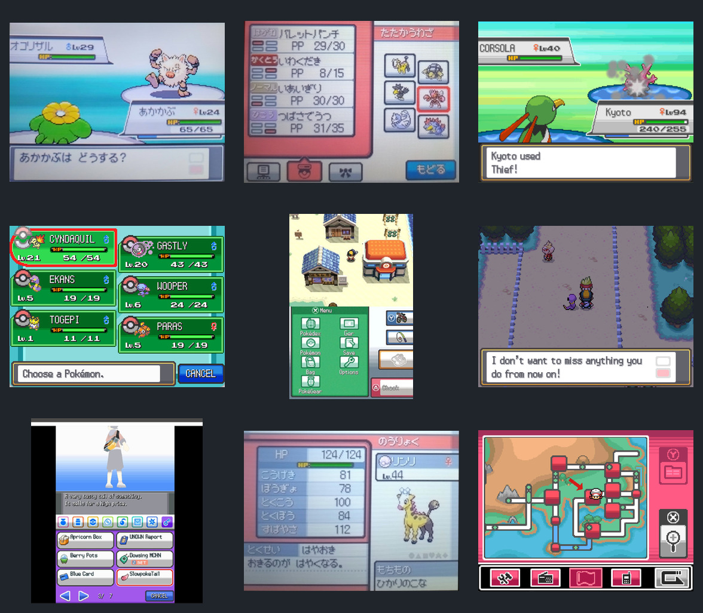

# Pokemon HeartGold UI/HUD references

포켓몬스터 하트골드/소울실버의 UI 문법을 Poke Lounge 리디자인에 적용하기 위한 비상업적 시각 참고 자료다. 원본 화면을 제품 에셋으로 배포하지 않고, 레이아웃·상태 표현·픽셀 스타일 분석에만 사용한다.

## 방향

- **Visual thesis:** 밝은 회백색 프레임, 진한 외곽선, 상황별 포인트 컬러와 픽셀 타이포그래피로 작은 면적에서도 상태가 즉시 읽히는 DS 시대 게임 UI.
- **Content plan:** 플레이 화면은 전투 상태와 행동 선택을 우선하고, 메뉴 화면은 파티·가방·상태·지도를 각각 한 가지 주 작업에 집중시킨다.
- **Interaction thesis:** 선택 테두리와 색 반전으로 포커스를 명확히 하고, 화면 전환은 짧은 패널 슬라이드/페이드, 버튼 입력은 즉각적인 눌림 상태와 짧은 사운드 피드백으로 표현한다.

## 이미지 인덱스

| 파일                           | 영역        | 참고할 요소                                      | 원문                                                                                         |
| ------------------------------ | ----------- | ------------------------------------------------ | -------------------------------------------------------------------------------------------- |
| `01-battle-command.jpg`        | 전투 HUD    | 좌우 비대칭 상태판, HP 우선순위, 하단 명령 영역  | [Note](https://note.com/gaming_messhi/n/n49d4c06d48bb)                                       |
| `02-battle-move-selection.jpg` | 기술 선택   | 4개 기술 목록, 타입 컬러, PP, 파티 미니 슬롯     | [Note](https://note.com/gaming_messhi/n/ncdeb5c5701da)                                       |
| `03-battle-message-hp.jpg`     | 전투 HUD    | 얇은 상태판과 넓은 메시지 박스의 레이어 구조     | [Guide Strats](https://guidestrats.com/pokemon-hgss-hard-stones/)                            |
| `04-party-selection.jpg`       | 포켓몬 슬롯 | 2열 3행, 선택 강조, HP/레벨/성별의 정보 밀도     | [Guide Strats](https://guidestrats.com/pokemon-hgss-how-to-beat-whitney/)                    |
| `05-main-menu.jpg`             | 메인 UI     | 2열 아이콘 메뉴, 화면 역할 분리, 현재 행동 표시  | [GamesRadar+](https://www.gamesradar.com/the-hidden-secrets-of-pokemon-heartgoldsoulsilver/) |
| `06-dialogue-overworld.png`    | 대화 HUD    | 하단 고정 대화창, 넓은 내부 여백, 다음 진행 표시 | [Pokemaniacal](https://pokemaniacal.com/2022/07/28/heart-gold-kingslocke-episode-5/)         |
| `07-bag-menu.jpg`              | 가방 UI     | 상단 설명, 카테고리 탭, 2열 항목, 페이지 이동    | [GameBanana](https://gamebanana.com/mods/631989)                                             |
| `08-summary-stats.jpg`         | 상태 UI     | 수치와 캐릭터 영역 분리, HP 바, 정보 그룹 계층   | [Note](https://note.com/gaming_messhi/n/ncdeb5c5701da)                                       |
| `09-pokegear-map.jpg`          | 지도 UI     | 지도 중심 구성, 우측 도구, 하단 모드 전환        | [Guide Strats](https://guidestrats.com/pokemon-hgss-tm32-double-team/)                       |

## Poke Lounge에 가져올 핵심 문법

- HUD는 월드를 가리지 않도록 화면 가장자리에 붙이고, 전투 메시지와 선택지는 하단에 고정한다.
- 포켓몬 슬롯은 `2 x 3` 구성을 기준으로 하되 이름, 레벨, HP, 상태 이상 순으로 읽히게 한다.
- 선택 상태는 크기 변화보다 굵은 외곽선과 명도 차이로 표현한다.
- 메뉴별 대표색은 달라도 프레임 두께, 모서리, 그림자, 글자 크기는 공통 토큰으로 묶는다.
